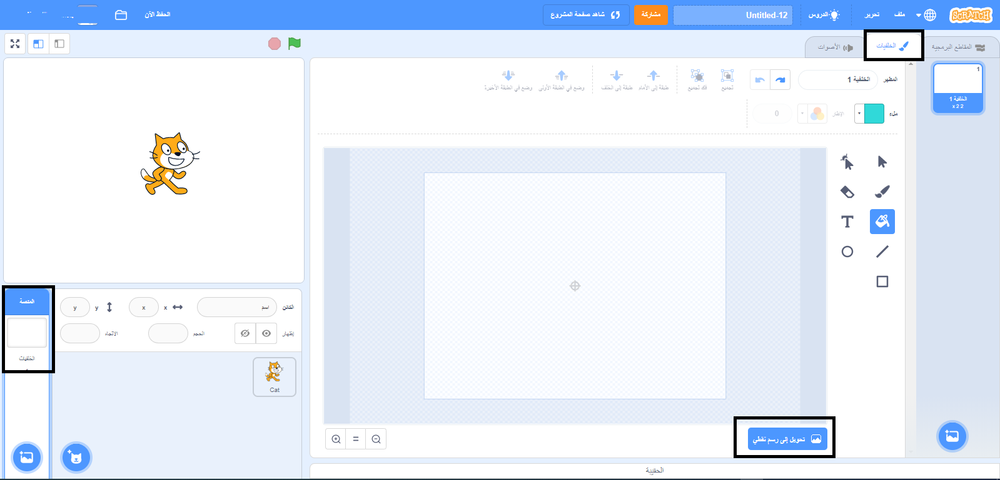

## السباحة إلى اليسار واليمين

في السباحة المتزامنة ، يقوم فريق من السباحين بإجراء روتين منسَّق من الحركات للموسيقى.

لنبدأ بجلب قطة واحدة للسباحة.

--- task ---

افتح مشروع فارغ جديد في Scratch.

**Online**: open a [new online Scratch project](http://rpf.io/scratchnew){:target="_blank"}.

**Offline**: open a new project in the offline editor.

If you need to download and install the Scratch offline editor, you can find it at [rpf.io/scratchoff](http://rpf.io/scratchoff){:target="_blank"}.

--- /task ---

دعنا أولاً نحول المنصة إلى اللون الأزرق حتى تبدو وكأنها مسبح.

--- task ---

انقر فوق "المنصة" ثم علامة التبويب "الخلفيات" ثم "تحويل إلى رسم نقطي".



--- /task ---

--- task ---

حدد اللون الأزرق وأداة "ملء بلون" ثم انقر على الخلفية.


--- /task ---

--- task ---

ستستخدم كائناً قطاً مختلفًا، لذا أنقر على علامة الخطأ الموجودة على القط الماشي لحذفه.


--- /task ---

--- task ---

إختر كائن`القط الطائر` من المكتبة وقم بإضافته لمشروعك.

[[[generic-scratch3-sprite-from-library]]]


تبدو القطة الطائرة وكأنها تسبح.

--- /task ---

--- task ---

الآن دعونا نجعل القط يسبح.

Select the 'Cat flying' sprite, click 'Code' and add the code to make the cat rotate left and right when you press the left and right arrow keys.


```blocks3
when [left arrow v] key pressed
turn ccw (15) degrees

when [right arrow v] key pressed
turn cw (15) degrees
```

--- /task ---

--- task ---

إختبر التعليمات البرمجية الخاصة بك بالضغط على مفاتيح الأسهم الأيسر والأيمن في لوحة المفاتيح.


--- /task ---

--- task ---

And add the code for the forward and backward movement.


```blocks3
when [up arrow v] key pressed
move (10) steps

when [down arrow v] key pressed
move (-10) steps 
```

--- /task ---

--- task ---

Test your code by swimming around the stage using the arrow keys.

--- /task ---
