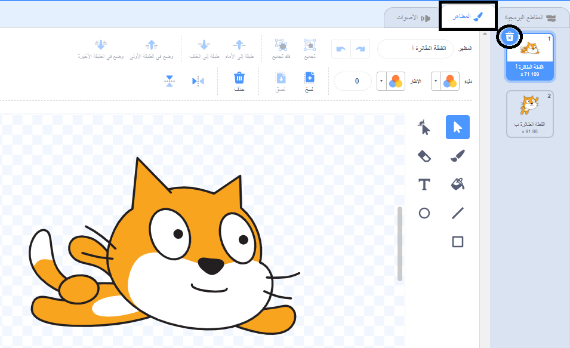
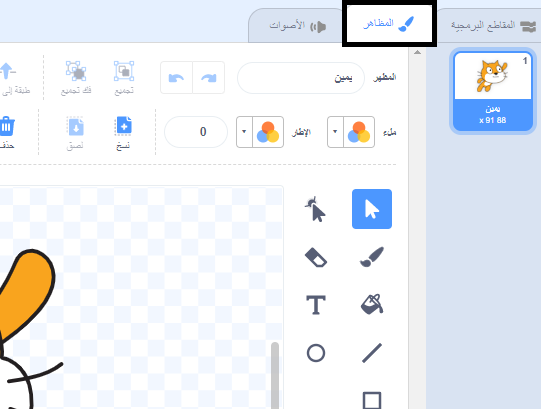
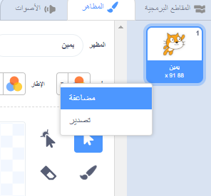
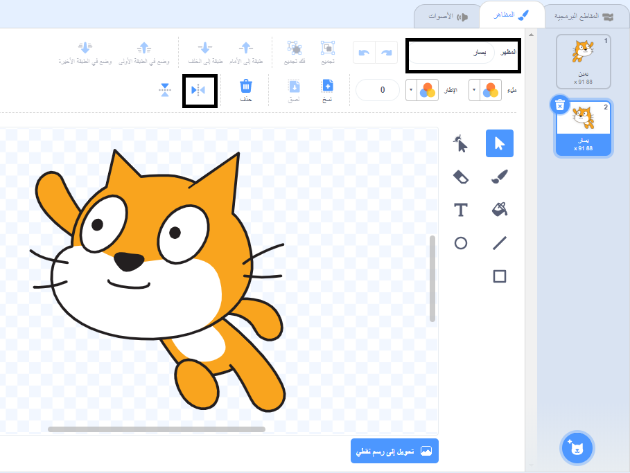

## تغيير المظهر

ممم، سيكون هذا أفضل إذا تغير إتجاه الكائن القط عندما يستدير إلى اليسار.

--- task ---

انقر على "المظاهر" واحذف مظهر"Cat Flying-a".



--- /task ---

--- task ---

أعد تسمية المظهر المتبقي، من "Cat Flying-b" إلى "يمين".



--- /task ---

--- task ---

انقر بزر الماوس الأيمن على المظهر ثم انقر فوق مضاعفة لإنشاء نسخة من المظهر.



--- /task ---

--- task ---

أنقر فوق "إعكس أفقياً" لعكس النسخة ثم قم بتسميتها "يسار".

المظاهر الخاصة بك يجب أن تبدو هكذا:



--- /task ---

--- task ---

انقر فوق "المقاطع البرمجية" للعودة إلى التعليمات البرمجية الخاصة بك وإضافة تعليمات برمجية لتغيير المظهر عند تغيير الاتجاه.


```blocks3
when [left arrow v] key pressed
+switch costume to (يسار v)
turn ccw (15) degrees

when [right arrow v] key pressed
+switch costume to (يمين v)
turn cw (15) degrees
```

--- /task ---

--- task ---

اختبر التعليمة البرمجية الخاصة بك بالسباحة حول المنصة باستخدام مفاتيح الأسهم.


--- /task ---
