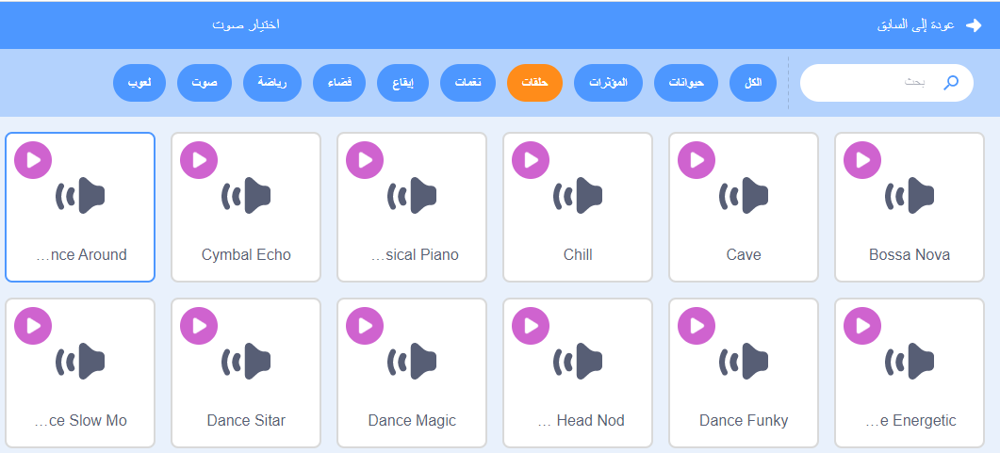

## موسيقى!

يحتاج روتين السباحة المتزامنة إلى الموسيقى. (ولكن إذا لم تتمكن من تشغيل الصوت ، فيمكنك تخطي هذه الخطوة.)

--- task ---

اختر صوت من فئة `تكرار` وأضفه إلى الكائن الخاص بك.

[[[generic-scratch3-sound-from-library]]]



--- /task ---

--- task ---

الآن عُد إلى "المقاطع البرمجية" وأضف التعليمة لتشغيل الموسيقى الخاصة بك:


```blocks3
when green flag clicked
forever
play sound (dance around v) until done
end
```

وضع `شغِّل الصوت `{:class="block3sound"} داخل `كرّر باستمرار`{:class="block3control"} يعني أن الموسيقى ستستمر في التكرار.

--- /task ---

--- task ---

اختبر مشروعك.

نصيحة: يمكنك النقر على زر التوقف الأحمر لإيقاف تشغيل الموسيقى!

--- /task ---

