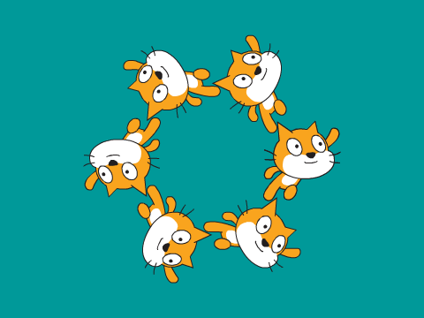

--- no-print ---

Dies ist die **Scratch 3** Version des Projekts. Es gibt auch eine [Scratch 2 Version des Projekts](https://projects.raspberrypi.org/en/projects/synchronised-swimming-scratch2).

--- /no-print ---

## Einleitung

Du wirst lernen, wie du eine Synchronschwimmroutine für "Scratch die Katze" programmierst, indem du Schleifen verwendest und Klone erstellst.

### Was du machen wirst

--- no-print ---

Verwende die Pfeiltasten, um die Schwimmer zu bewegen.

  <iframe allowtransparency="true" width="485" height="402" src="https://scratch.mit.edu/projects/embed/113149575/?autostart=false" frameborder="0" scrolling="no">></iframe>
  

Tipp: Du kannst auf die rote Stopptaste klicken, um die Musikwiedergabe zu stoppen!

--- /no-print ---

--- print-only ---

--- /print-only ---

--- collapse ---
---
title: Was du brauchen wirst
---

### Hardware

+ Ein Computer, auf dem Scratch ausgeführt werden kann

### Software

+ Scratch 3 (entweder [online](http://rpf.io/scratchon){:target="_blank"} oder [offline](http://rpf.io/scratchoff){:target="_blank"})

--- /collapse ---

--- collapse ---
---
title: Was du lernen wirst
---

- Verwende Klone, um viele gleiche Figuren zu erstellen
- Verwende Tastendruck-Ereignisse, um Figuren zu bewegen

--- /collapse ---

--- collapse ---
---
title: Zusätzliche Informationen für Pädagogen
---

--- no-print ---

Wenn du dieses Projekt ausdrucken möchtest, verwende die [druckerfreundliche Version](https://projects.raspberrypi.org/en/projects/synchronised-swimming/print){:target="_blank"}.

--- /no-print ---

Du findest das [abgeschlossene Projekt hier](http://rpf.io/p/en/synchronised-swimming-get){:target="_blank"}.

--- /collapse ---
