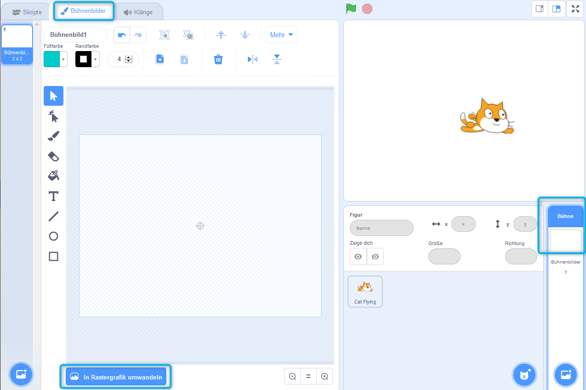
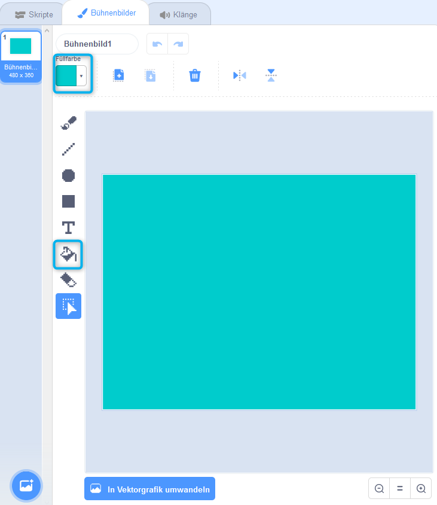
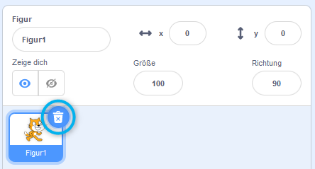

## Nach links und rechts schwimmen

Beim Synchronschwimmen führt ein Schwimmteam koordinierte Bewegungen zur Musik aus.

Beginnen wir damit, eine Katze schwimmen zu lassen.

--- task ---

Erstelle ein neues Scratch-Projekt.

**Online**: Öffne ein [neues online Scratch-Projekt](https://rpf.io/scratchnew){:target="_blank"}.

**Offline**: Öffne ein neues Projekt im Offline-Editor.

Wenn du den Scratch-Offline-Editor herunterladen und auf deinem Rechner installieren möchtest, findest du die Datei unter diesem Link: [rpf.io/scratchoff](https://rpf.io/scratchoff){:target="_blank"}.

--- /task ---

Lass uns zuerst die Bühne blau machen, damit sie wie ein Schwimmbad aussieht.

--- task ---

Klicke auf "Bühne", dann auf die Registerkarte "Bühnenbilder" und dann auf "In Rastergrafik umwandeln".



--- /task ---

--- task ---

Wähle eine blaue Farbe und das Werkzeug "Mit Farbe füllen" und klicke dann auf den Hintergrund.



--- /task ---

--- task ---

Du wirst eine andere Katzenfigur verwenden. Klicke also auf das Kreuz auf der laufenden Katze, um sie zu löschen.



--- /task ---

--- task ---

Wähle die `Cat Flying` Figur aus der Bibliothek aus und füge sie deinem Projekt hinzu.

[[[generic-scratch3-sprite-from-library]]]


Die fliegende Katze sieht aus, als könnte sie schwimmen.

--- /task ---

--- task ---

Jetzt lass die Katze schwimmen.

Wähle die "Cat flying" (Katze fliegt) Figur aus. Klicke auf "Skripte" und füge den Code hinzu, damit sich die Katze nach links oder rechts dreht, wenn die linke oder rechte Pfeiltaste gedrückt wird.


```blocks3
when [left arrow v] key pressed
turn ccw (15) degrees

when [right arrow v] key pressed
turn cw (15) degrees
```

--- /task ---

--- task ---

Teste deinen Code, indem du die linke und rechte Pfeiltaste auf der Tastatur drückst.


--- /task ---

--- task ---

Und füge den Code für die Vorwärts- und Rückwärtsbewegung hinzu.


```blocks3
when [up arrow v] key pressed
move (10) steps

when [down arrow v] key pressed
move (-10) steps
```

--- /task ---

--- task ---

Teste deinen Code, indem du mit den Pfeiltasten über die Bühne schwimmst.

--- /task ---
