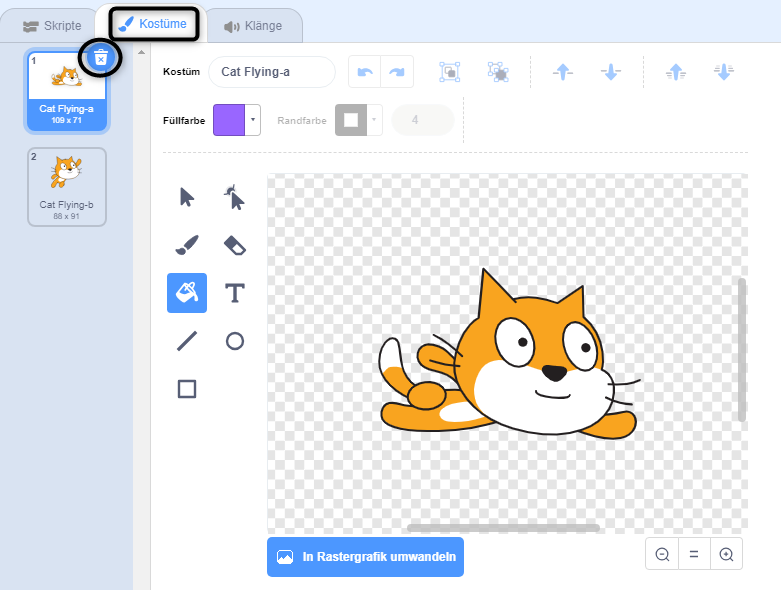
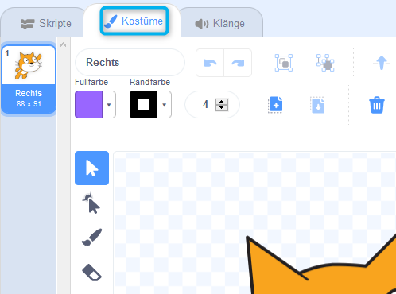
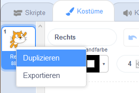
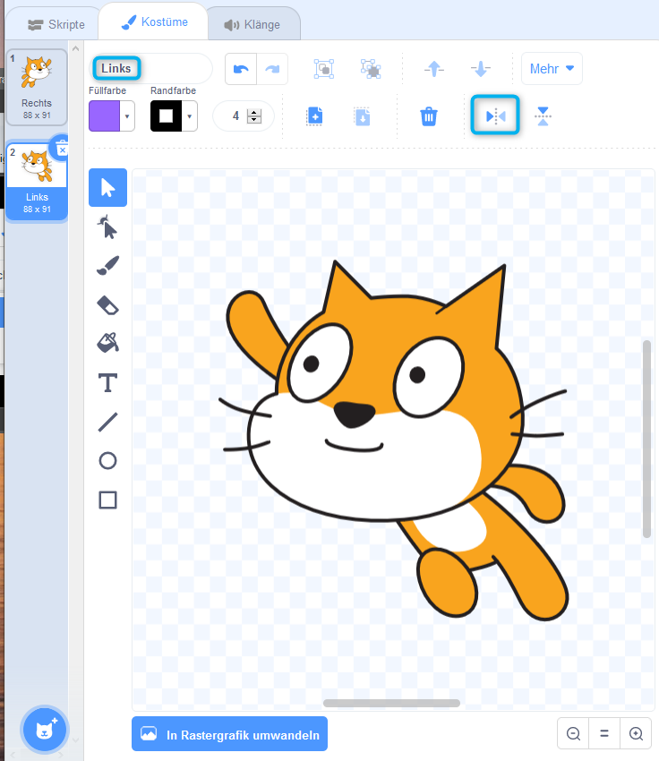

## Kostüm wechseln

Hmm, es würde besser aussehen, wenn die Katzenfigur die Richtung ändert, wenn es sich links herum dreht.

--- task ---

Klicke auf "Kostüme" und lösche das Kostüm "cat flying-a".



--- /task ---

--- task ---

Benenne das verbleibende Kostüm von "cat flying-b" in "Rechts" um.



--- /task ---

--- task ---

Klicke mit der rechten Maustaste auf das Kostüm und wähle Duplizieren, um eine Kopie zu erstellen.



--- /task ---

--- task ---

Klicke auf "Horizontal spiegeln", um die Kopie zu spiegeln. Nenne sie dann "Links".

Deine Kostüme sollten so aussehen:



--- /task ---

--- task ---

Klicke auf "Skripte", um zu deinem Code zurückzukehren. Füge Blöcke hinzu, um das Kostüm zu ändern, wenn die Richtung geändert wird.


```blocks3
when [left arrow v] key pressed
+switch costume to (Links v)
turn ccw (15) degrees

when [right arrow v] key pressed
+switch costume to (Rechts v)
turn cw (15) degrees
```

--- /task ---

--- task ---

Teste deinen Code, indem du mit den Pfeiltasten über die Bühne schwimmst.


--- /task ---
