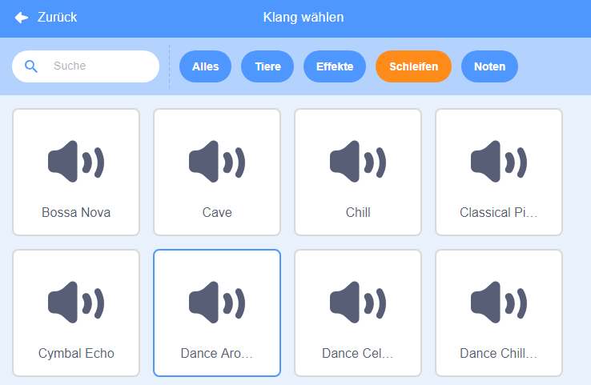

## Musik!

Eine Synchronschwimmroutine braucht Musik. (Falls du keinen Ton abspielen kannst, kannst du diesen Schritt überspringen.)

--- task ---

Wähle einen Sound aus der Kategorie `Schleifen` und füge ihn deiner Figur hinzu.

[[[generic-scratch3-sound-from-library]]]



--- /task ---

--- task ---

Geh nun zurück zu 'Skripte' und füge die Blöcke hinzu, um deine Musik abzuspielen:


```blocks3
Wenn die grüne Flagge angeklickt wird
wiederhole fortlaufend
spiele Klang (dance around) ganz
ende
```

Wenn du den `spiele Klang`{:class="block3sound"}-Block in eine `wiederhole fortlaufend`{:class="block3control"}-Schleife einfügst, wird die Musik ständig wiederholt.

--- /task ---

--- task ---

Teste dein Projekt.

Du kannst auf die rote Stopp-Schaltfläche klicken, um die Musikwiedergabe zu stoppen!

--- /task ---

