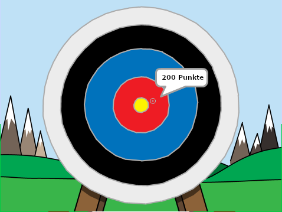

## Wie geht's weiter?

Schau dir das [Bogenschießen](https://projects.raspberrypi.org/en/projects/archery) Scratch-Projekt an.

--- no-print ---

Klicke zum Starten auf die grüne Flagge. Verwende die Leertaste, um einen Pfeil abzuschießen

  <iframe allowtransparency="true" width="485" height="402" src="https://scratch.mit.edu/projects/embed/114760038/?autostart=false" frameborder="0" scrolling="no"></iframe>
  

--- /no-print ---

--- print-only ---

--- /print-only ---
