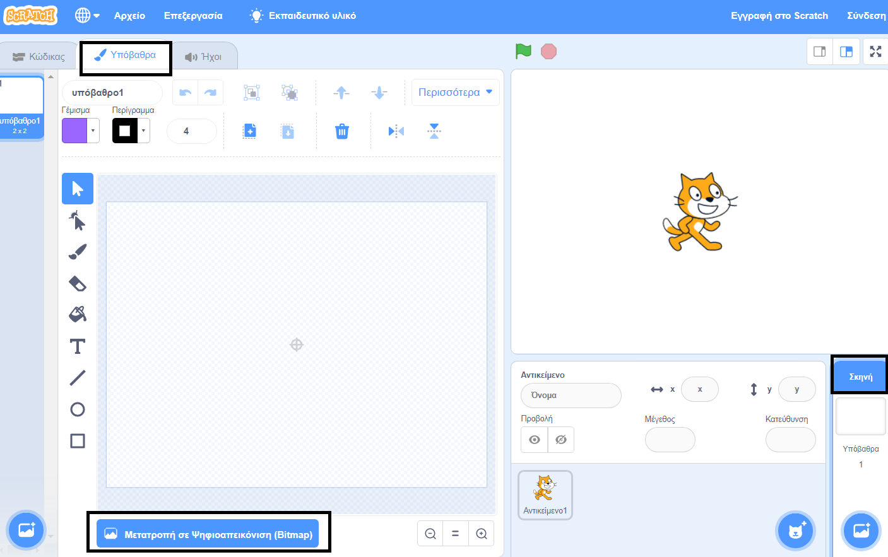
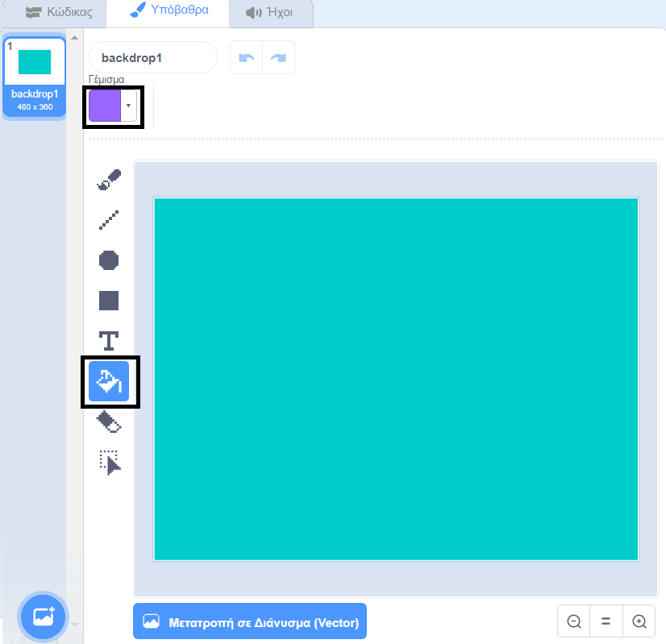
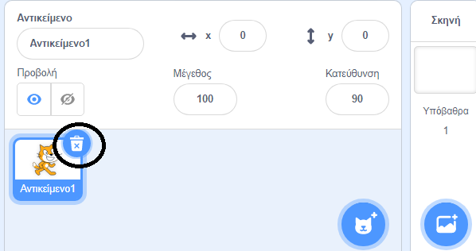

## Κολυμπώντας αριστερά και δεξιά

Στη συγχρονισμένη κολύμβηση μια ομάδα κολυμβητών εκτελεί μια συντονισμένη ρουτίνα κινήσεων με μουσική.

Ας ξεκινήσουμε κάνοντας μια γάτα να κολυμπάει.

--- task ---

Δημιούργησε ένα νέο έργο Scratch.

**Σε σύνδεση**: άνοιξε ένα [νέο online έργο Scratch](http://rpf.io/scratchnew){:target="_blank"}.

**Eκτός σύνδεσης**: άνοιξε ένα νέο έργο στο Scratch.

Αν χρειαστεί να κατεβάσεις και να εγκαταστήσεις τον επεξεργαστή εκτός σύνδεσης για το Scratch, μπορείς να τον βρεις στο [rpf.io/scratchoff](http://rpf.io/scratchoff){:target="_blank"}.

--- /task ---

Αρχικά, ας κάνουμε τη σκηνή μπλε, έτσι ώστε να μοιάζει με πισίνα.

--- task ---

Κάνε κλικ στο «Σκηνή» και μετά στην καρτέλα «Υπόβαθρα» και «Μετατροπή σε Ψηφιοαπεικόνιση (Bitmap)».



--- /task ---

--- task ---

Επίλεξε ένα μπλε χρώμα και το εργαλείο "Γέμισμα" και στη συνέχεια, κάνε κλικ στο φόντο.



--- /task ---

--- task ---

Πρόκειται να χρησιμοποιήσεις ένα διαφορετικό αντικείμενο γάτας, οπότε κάνε κλικ στο x της γάτας για να τη διαγράψεις.



--- /task ---

--- task ---

Βρες το αντικείμενο `Cat Flying` από τη βιβλιοθήκη και πρόσθεσέ το στο έργο σου.

[[[generic-scratch3-sprite-from-library]]]


Η ιπτάμενη γάτα μοιάζει σα να κολυμπά.

--- /task ---

--- task ---

Τώρα ας κάνουμε τη γάτα να κολυμπάει.

Επίλεξε το αντικείμενο "Cat flying", κάνε κλικ στο "Κώδικας" και βάλε τον κώδικα για να κάνεις τη γάτα να περιστρέφεται αριστερά και δεξιά όταν πατάς το αριστερό και το δεξί βελάκι.


```blocks3
when [left arrow v] key pressed
turn ccw (15) degrees

when [right arrow v] key pressed
turn cw (15) degrees
```

--- /task ---

--- task ---

Έλεγξε τον κώδικά σου πατώντας το αριστερό και το δεξί βελάκι στο πληκτρολόγιο.


--- /task ---

--- task ---

Και πρόσθεσε τον κώδικα για την κίνηση προς τα εμπρός και προς τα πίσω.


```blocks3
when [up arrow v] key pressed
move (10) steps

when [down arrow v] key pressed
move (-10) steps
```

--- /task ---

--- task ---

Δοκίμασε τον κώδικά σου κολυμπώντας γύρω από τη σκηνή χρησιμοποιώντας τα βελάκια.

--- /task ---
