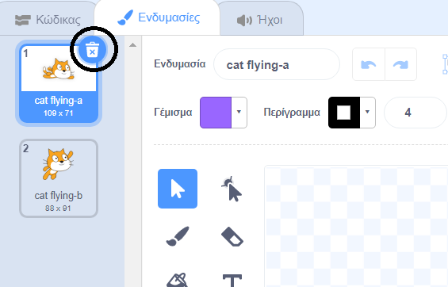
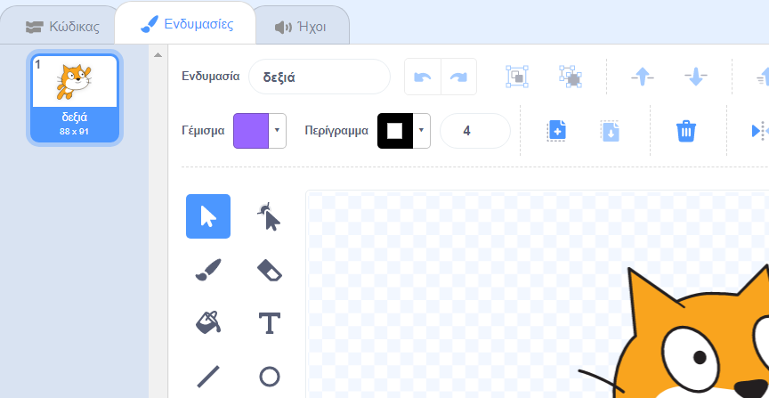
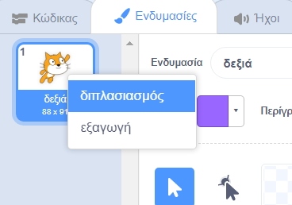
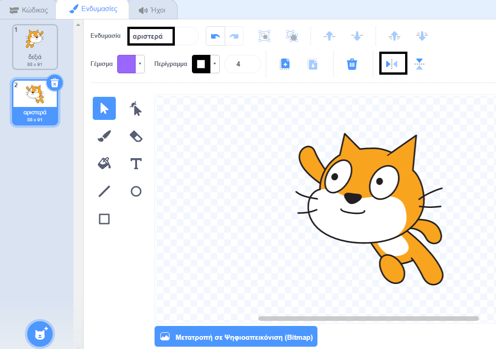
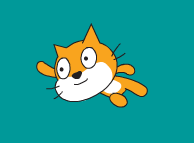

## Αλλαγή ενδυμασίας

Χμμ, θα φαινόταν καλύτερα αν το αντικείμενο της γάτας αλλάζει κατεύθυνση όταν στρίβει αριστερά.

--- task ---

Κάνε κλικ στο «Ενδυμασίες» και σβήσε την ενδυμασία «cat flying-a».



--- /task ---

--- task ---

Μετονόμασε την ενδυμασία "cat flying-b" σε "δεξιά".



--- /task ---

--- task ---

Κάνε δεξί κλικ στην ενδυμασία και επίλεξε τον διπλασιασμό για να δημιουργήσεις ένα αντίγραφο.



--- /task ---

--- task ---

Κάνε κλικ στο «Οριζόντια Αναστροφή» για να αντιστρέψεις το αντίγραφο και, στη συνέχεια, ονόμασέ το «αριστερά».

Οι ενδυμασίες θα πρέπει να είναι κάπως έτσι:



--- /task ---

--- task ---

Κάνε κλικ στο «Κώδικας» για να επιστρέψεις στον κώδικά σου και πρόσθεσε μερικά μπλοκ για να αλλάξεις την ενδυμασία όταν αλλάξει η κατεύθυνση.


```blocks3
when [left arrow v] key pressed
+switch costume to (αριστερά v)
turn ccw (15) degrees

when [right arrow v] key pressed
+switch costume to (δεξιά v)
turn cw (15) degrees
```

--- /task ---

--- task ---

Δοκίμασε τον κώδικά σου κολυμπώντας γύρω από τη σκηνή χρησιμοποιώντας τα βελάκια.



--- /task ---
