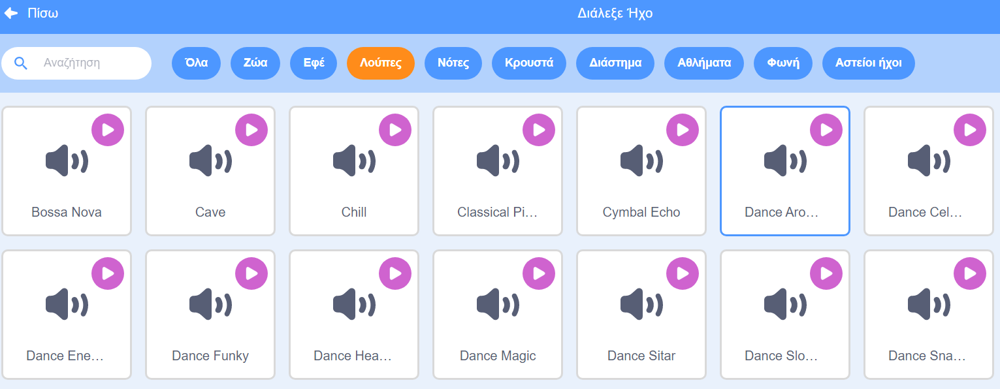

## Μουσική!

Μια ρουτίνα συγχρονισμένης κολύμβησης χρειάζεται μουσική. (Αλλά, αν δεν μπορείς να παίξεις ήχο, τότε μπορείς να παραλείψεις αυτό το βήμα.)

--- task ---

Βρες έναν ήχο από την κατηγορία `Λούπες` και πρόσθεσε στο αντικείμενο σου.

[[[generic-scratch3-sound-from-library]]]



--- /task ---

--- task ---

Τώρα πήγαινε πίσω στον "Κώδικα" και βάλε εντολές για να παίξεις τη μουσική σου:


```blocks3
when green flag clicked
forever
play sound (dance around v) until done
end
```

Βάζοντας την εντολή `παίξε ήχο`{:class="block3sound"} μέσα σε ένα βρόχο `για πάντα`{:class="block3control"} σημαίνει ότι η μουσική θα επαναλαμβάνεται συνεχώς.

--- /task ---

--- task ---

Δοκίμασε το έργο σου.

Μπορείς να κάνεις κλικ στο κόκκινο κουμπί διακοπής για να σταματήσεις την αναπαραγωγή της μουσικής!

--- /task ---

