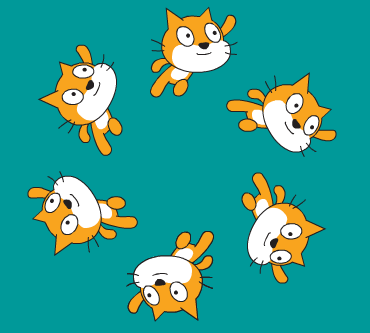

## Προγραμματισμένες ρουτίνες

Θα ήθελες να μπορείς να τελειοποιήσεις μια ρουτίνα και να μπορείς να την επαναλάβεις εύκολα;

--- task ---

Ας προσθέσουμε μερικές κινήσεις που θα εκτελεστούν όταν πατήσεις το πλήκτρο διαστήματος (space).


```blocks3
when [space v] key pressed
switch costume to (δεξιά v)
repeat (36)
turn cw (10) degrees
move (10) steps
end
```

--- /task ---

--- task ---

Εκτέλεσε το πρόγραμμα και πάτησε το πλήκτρο διαστήματος για να δοκιμάσεις τη νέα ρουτίνα.



Δοκίμασε να χρησιμοποιήσεις τα βελάκια για να μετακινηθείς σε διαφορετική θέση προτού πατήσεις το διάστημα.

--- /task ---


