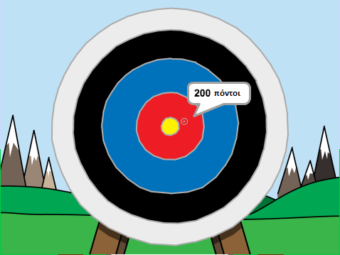

## Τι υπάρχει στη συνέχεια;

Ρίξε μια ματιά στο έργο [Archery](https://projects.raspberrypi.org/el-GR/projects/archery).

--- no-print ---

Κάνε κλικ στην πράσινη σημαία για να ξεκινήσεις. Χρησιμοποίησε το πλήκτρο διαστήματος για να ρίξεις ένα βέλος

  <iframe allowtransparency="true" width="485" height="402" src="https://scratch.mit.edu/projects/embed/382057891/?autostart=false" frameborder="0" scrolling="no"></iframe>
  

--- /no-print ---

--- print-only ---

--- /print-only ---

***
Το έργο αυτό μεταφράστηκε από τους εθελοντές:

Αλέξανδρος Ρονιώτης (Σύλλογος ΨηφίΔα)
Κυριακή Ιντζεΐδου

Χάρη στους εθελοντές, μπορούμε να δώσουμε σε ανθρώπους σε όλο τον κόσμο την ευκαιρία να μάθουν στη γλώσσα τους. Μπορείτε να μας βοηθήσετε να προσεγγίσουμε περισσότερους ανθρώπους μεταφράζοντας εθελοντικά - περισσότερες πληροφορίες στο [rpf.io/translate](https://rpf.io/translate).
