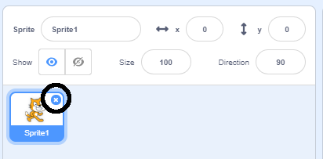
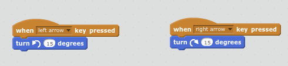
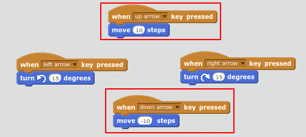

## Swimming left and right

In synchronised swimming a team of swimmers perform a coordinated routine of moves to music. 

Let's start by getting one cat swimming. 

+ Create a new Scratch project. You can find the online Scratch editor at <a href="http://jumpto.cc/scratch-new" target="_blank">jumpto.cc/scratch-new</a>.

+ First let's turn the stage blue so it looks like a swimming pool. 

	Click on the Stage and then the `Backdrops` Tab. 
	
	Choose a blue colour from the palette, click the 'Fill with color' tool and then click on the backdrop. 

	

+ You're going to use a different cat sprite so right-click on the walking cat to delete it. 

	

+ Now click 'Choose sprite from library'. 

	

+ Select 'Animals' and choose 'Cat1 Flying' and click 'OK'. 

	

	The flying cat looks like it could be swimming. 
	
+ Now let's get the cat swimming. 

	Click on the 'Cat1 flying' sprite and then 'Scripts' and add code to make the cat rotate left and right when you press the left and right arrow keys. 
	
	
	
	
+ Test your code by pressing the left and right arrow keys on the keyboard.

	

+ And add forward and backward movement:

	

+ Test your code by swimming around the stage using the arrow keys. 

