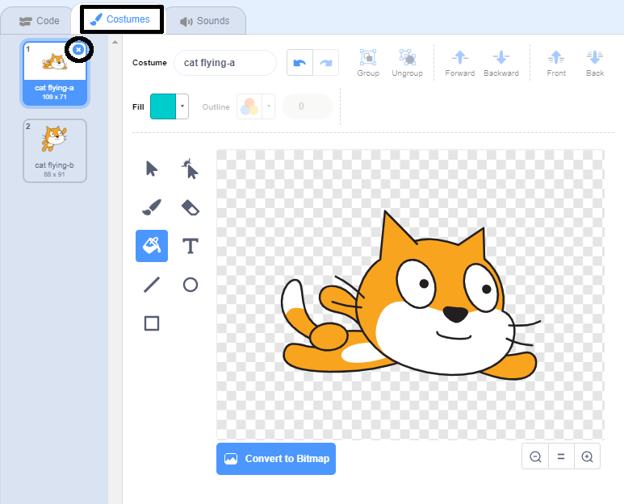
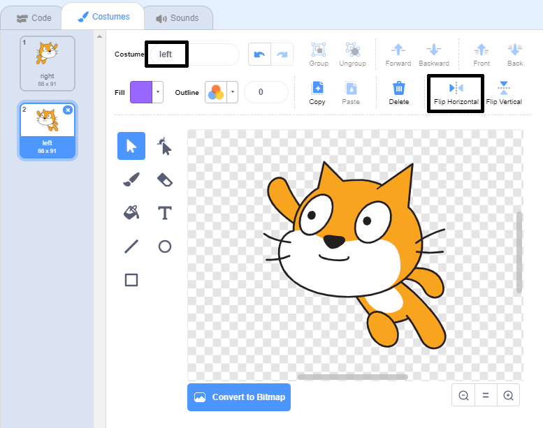
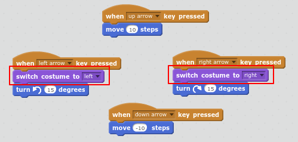

## Changing costume

Hmm, this would look better if the cat sprite changed direction when it turns left. 

+ Click on 'Costumes' and delete the 'cat1 flying-a' costume.

	 
	
+ Rename the remaining costume from 'cat1 flying-b' to 'right'. 

	

+ Right-click on the costume and choose duplicate to create a copy. 

	

+ Click 'Flip left-right' to reverse the copy and then name it 'left'. 

	Your costumes should look like this:

	

+ Click 'Scripts' to return to your code and add blocks to change the costume when the direction is changed. 

	

+ Test your code by swimming around the stage using the arrow keys. 

	

