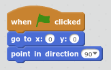
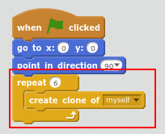
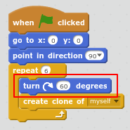

## Create the team

Synchronised swimming needs more than one cat! We can use `create clone of`{:class="blockcontrol"} to create copies that behave in the same way. 

+ First let's add code to make sure the cat always starts in the same position when you click the green flag. 

	
	
+ Test your code by pressing some arrow keys and then clicking the green flag to return to the start position. 

+ Now we can use a `repeat`{:class="blockcontrol"} loop to create 6 clones (copies) of the cat. 

	Loops are used to do the same thing multiple times. 
	
	

+ You don't want all the cats to be in the same position! 

	Add code to rotate 60 degrees before creating each clone. 
	
	
	
+  Test your code by using the arrow keys. You should be able to create some amazing synchronised swimming patterns!

	

