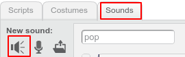
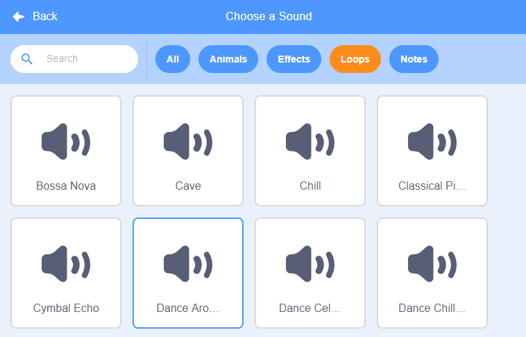
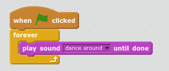

## Music!

A synchronised swimming routine needs music. (But, if you can't play sound then you can skip this step.)

+ Click on the `Sounds` tab and then click 'Choose new sound from library'. 

	

+ Choose 'Music Loops' and choose some music and then click 'OK'. 

	

+ Now go back to 'Scripts' and add the blocks to play your music: 

	
	
	Putting the `play sound`{:class="blocksound"} inside a `forever`{:class="blockcontrol"} loop means the music will keep repeating. 

+ Test your project. 

	You can click on the red stop button to stop the music playing!

