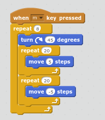

--- challenge ---
## Challenge: Code your own routine

Can you write your own synchronised swimming routine to be performed when you press the space key or another key?

Try working out a routine using the arrow keys first. 

Use `repeat`{:class="blockcontrol"} loops to perform the same actions multiple times. 

Here's an example:

--- /challenge ---