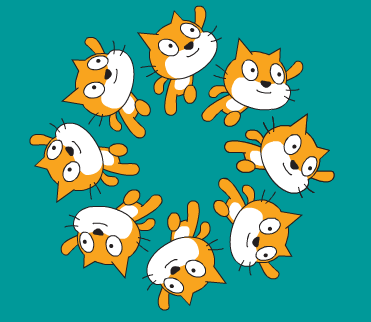

--- challenge ---
## Challenge: change the team

Can you change the number of swimmers in the team? Synchronised swimming teams usually have eight members but can have as few as four. 

Hint: As well as changing the number of swimmers you'll need to change their starting position. 

Hint: 360 divided by 8 is 45; 360 divided by 4 is 90.

You could also change the sprite that you use. 

--- /challenge ---
