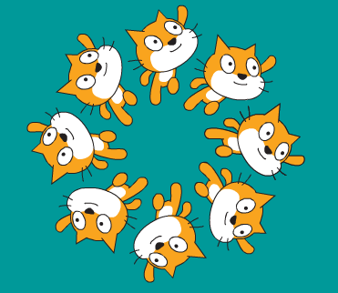

## Challenge: change the team

Can you change the number of swimmers in the team? Synchronised swimming teams usually have eight members but can have as few as four. 

--- hints ---
--- hint ---

360 divided by 8 is 45; 360 divided by 4 is 90.

--- /hint ---
--- /hints ---

You could also change the sprite that you use. 
