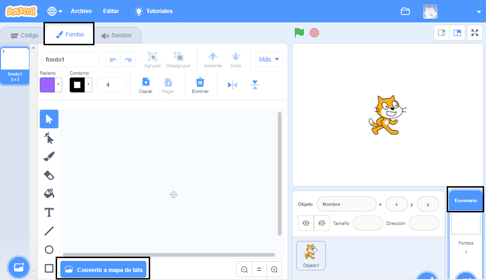
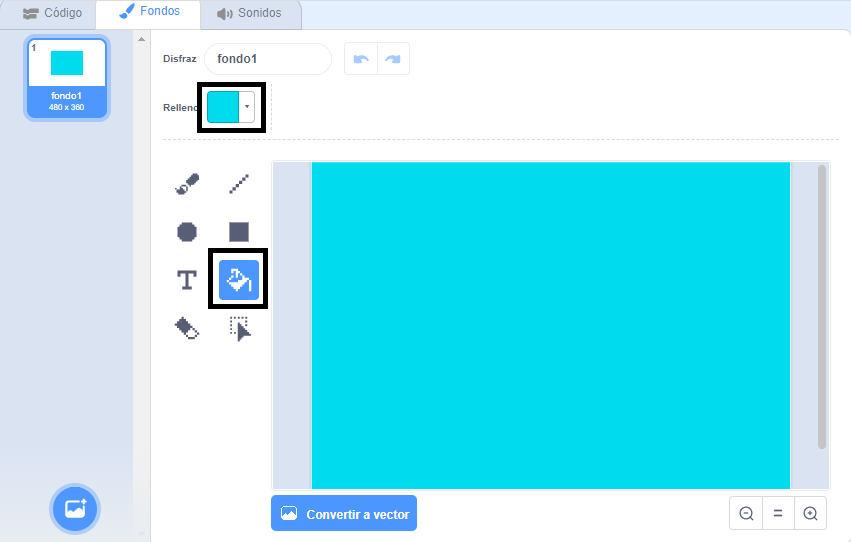
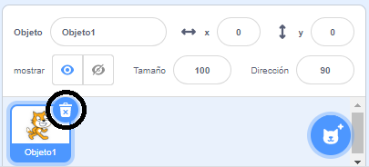
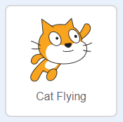

## Nadando a izquierda y derecha

En la natación sincronizada, un equipo de nadadores realiza una rutina coordinada de movimientos con música.

Comencemos haciendo nadar a un gato.

--- task ---

Abre un nuevo proyecto en Scratch.

**En línea**: abre un [ nuevo proyecto Scratch en línea](http://rpf.io/scratchnew) {:target="_blank"}.

**Sin conexión:** abre un nuevo proyecto en el editor sin conexión.

Si necesita descargar e instalar el editor sin conexión de Scratch, puede encontrarlo en [ rpf.io/scratchoff ](http://rpf.io/scratchoff) {: target = "_ blank"}.

--- /task ---

Primero cambiemos el escenario a azul para que parezca una piscina.

--- task ---

Haz clic en el 'Escenario' y luego en la pestaña 'Fondos' y 'Convertir a mapa de bits'.



--- /task ---

--- task ---

Selecciona un color azul y la herramienta 'Rellenar con color' y luego haz clic en el fondo.



--- /task ---

--- task ---

Vas a usar un objeto gato diferente así que haz clic en la cruz del gato andador para eliminarlo.



--- /task ---

--- task ---

Elige el objeto `Cat flying` (nota: Gato volador) de la biblioteca y añádelo a tu proyecto.

[[[generic-scratch3-sprite-from-library]]]



El gato volador parece como si estuviera nadando.

--- /task ---

--- task ---

Ahora hagamos que el gato nade.

Selecciona el objeto 'Gato volador', haz clic en 'Código' y agrega el código para hacer que el gato gire a izquierda y derecha cuando presiones las teclas de flecha izquierda y derecha.


```blocks3
when [left arrow v] key pressed
turn ccw (15) degrees

when [right arrow v] key pressed
turn cw (15) degrees
```

--- /task ---

--- task ---

Pruebe tu código presionando las teclas de flecha izquierda y derecha en el teclado.


--- /task ---

--- task ---

Y añade el código para el movimiento hacia adelante y hacia atrás.


```blocks3
when [up arrow v] key pressed
move (10) steps

when [down arrow v] key pressed
move (-10) steps 
```

--- /task ---

--- task ---

Prueba tu código nadando alrededor del escenario usando las flechas del teclado.

--- /task ---
