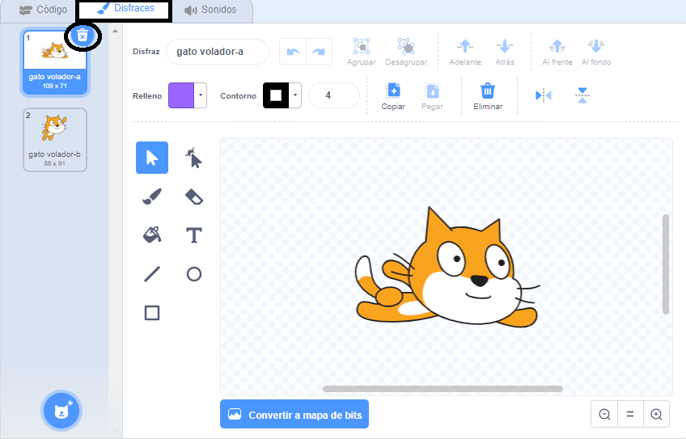
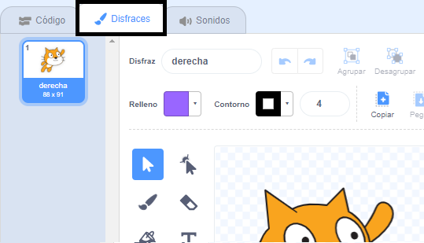
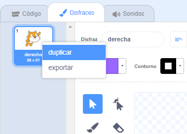
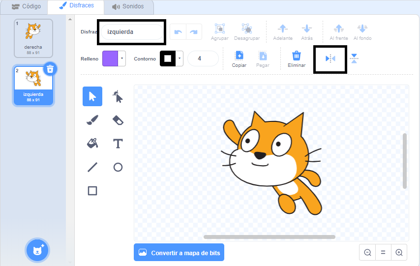

## Cambiando el disfraz

Hmm, esto se vería mejor si el objeto gato cambiara de dirección cuando gire a la izquierda.

--- task ---

Haga clic en 'Disfraces' y elimina el disfraz 'gato volador-a'.



--- /task ---

--- task ---

Cambia el nombre del disfraz que queda de 'gato volador-b' a 'derecha'.



--- /task ---

--- task ---

Haz clic en el botón derecho sobre el disfraz y luego haz clic en Duplicar para crear una copia.



--- /task ---

--- task ---

Haga clic en 'Voltear horizontalmente' para invertir la copia y luego asígnala el nombre 'izquierda'.

Tus disfraces deberían verse así:



--- /task ---

--- task ---

Haga clic en 'Código' para volver al código y agrega estos bloques para cambiar el disfraz cuando se cambia la dirección.


```blocks3
when [left arrow v] key pressed
+switch costume to (left v)
turn ccw (15) degrees

when [right arrow v] key pressed
+switch costume to (right v)
turn cw (15) degrees
```

--- /task ---

--- task ---

Prueba el código nadando alrededor del escenario usando las flechas del teclado.


--- /task ---
