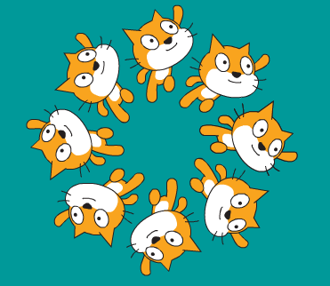

## Desafío: cambiar el equipo

¿Puedes cambiar el número de nadadores en el equipo? Los equipos de natación sincronizada generalmente tienen ocho miembros, pero pueden tener tan solo cuatro.

--- hints ---

--- hint ---

Además de cambiar el número de nadadores necesitarás cambiar su posición inicial.

--- /hint ---

--- hint ---

360 dividido entre 8 es 45; 360 dividido por 4 es 90.

--- /hint ---

--- /hints ---

También puedes cambiar el objeto que utilices. 
