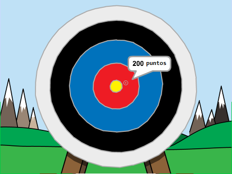

## ¿Qué hacer a continuación?

Echa un vistazo al proyecto de Scratch [Tiro con arco](https://projects.raspberrypi.org/en/projects/archery).

--- no-print ---

Haz clic en la bandera verde para empezar. Usa la barra espaciadora para disparar una flecha

  <iframe allowtransparency="true" width="485" height="402" src="https://scratch.mit.edu/projects/embed/114760038/?autostart=false" frameborder="0" scrolling="no"></iframe>
  

--- /no-print ---

--- print-only ---

--- /print-only ---
