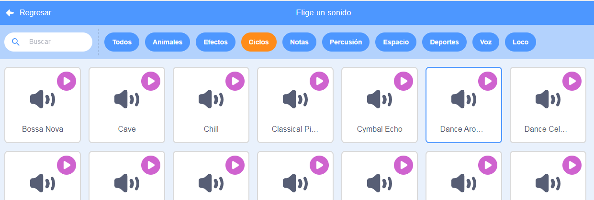

## ¡Música!

Una rutina de nado sincronizado necesita música. (Pero, si no puedes reproducir sonido, puedes saltarte este paso.)

--- task ---

Elige un sonido de la categoría `Bucles` y añádelo a tu objeto.

[[[generic-scratch3-sound-from-library]]]



--- /task ---

--- task ---

Ahora regresa a 'Código' y agrega estos bloques para reproducir tu música:


```blocks3
when green flag clicked
forever
play sound (dance around v) until done
end
```

Al colocar el `tocar sonido`{:class="block3sound"} dentro de un bucle `por siempre`{:class="block3control"} significa que la música seguirá repitiéndose.

--- /task ---

--- task ---

Prueba tu proyecto.

Consejo: ¡Puedes hacer clic en el botón rojo para detener la música!

--- /task ---

