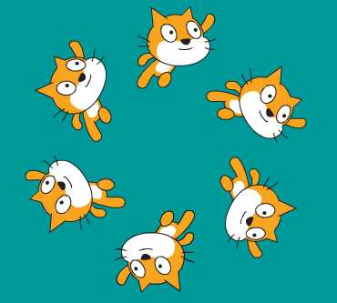

## Rutinas programadas

¿Te gustaría poder perfeccionar una rutina y repetirla fácilmente?

--- task ---

Agreguemos algunos movimientos a realizar cuando se presiona la tecla espacio.


```blocks3
when [space v] key pressed
switch costume to (right v)
repeat (36)
turn cw (10) degrees
move (10) steps
end
```

--- /task ---

--- task ---

Ejecuta el proyecto y presiona la barra espaciadora para probar la nueva rutina.



Intenta usar las flechas del teclado para moverte a una posición diferente antes de presionar el espacio.

--- /task ---


