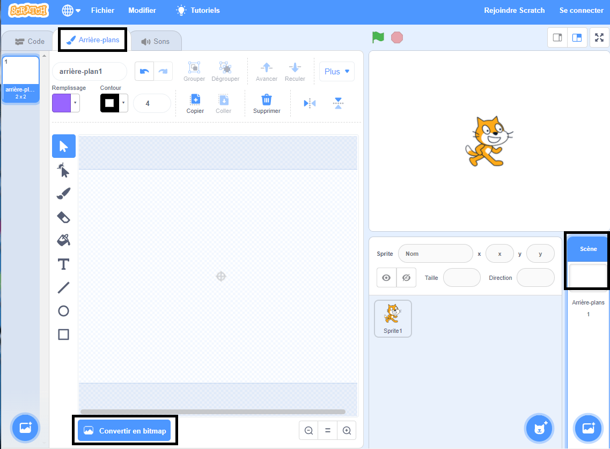
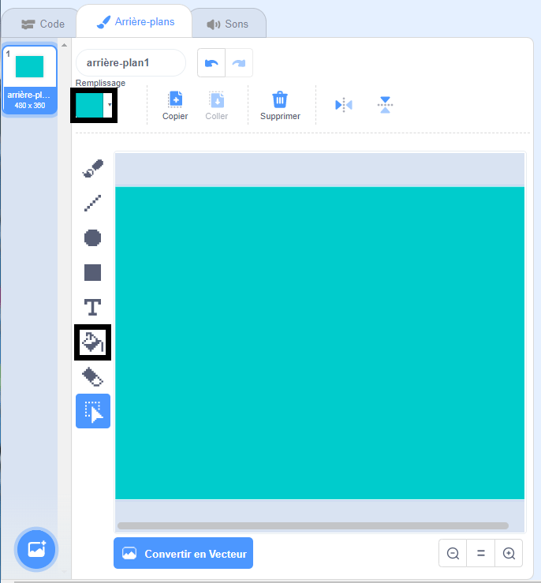
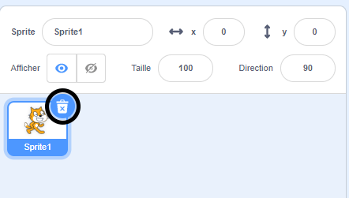
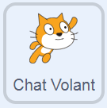

## Nager à gauche et à droite

Dans la natation synchronisée, une équipe de nageurs effectue une chorégraphie coordonnée de déplacements en musique.

Commençons par faire nager un chat.

--- task ---

Ouvre un nouveau projet Scratch.

**En ligne** : ouvre un [nouveau projet Scratch en ligne](http://rpf.io/scratchnew){:target="_blank"}.

**Hors-ligne**: ouvre un nouveau projet dans l’éditeur hors-ligne.

Si tu dois télécharger et installer l'éditeur hors-ligne Scratch, tu peux le trouver à [rpf.io/scratchoff](http://rpf.io/scratchoff){:target="_blank"}.

--- /task ---

Commençons par mettre la scène en bleu pour qu'elle ressemble à une piscine.

--- task ---

Clique sur la « Scène » puis sur l'onglet « Arrière-plans » et « Convertir en Bitmap ».



--- /task ---

--- task ---

Sélectionne une couleur bleue et l'outil « Remplissage » puis clique sur l'arrière-plan.



--- /task ---

--- task ---

Tu vas utiliser un sprite de chat différent, alors clique sur la croix sur le chat qui marche pour le supprimer.



--- /task ---

--- task ---

Choisis le sprite `Chat Volant` à partir de la bibliothèque et ajoute-le à ton projet.

[[[generic-scratch3-sprite-from-library]]]



Le chat volant semble pouvoir nager.

--- /task ---

--- task ---

Maintenant laissons le chat nager.

Sélectionne le sprite « Chat Volant », clique sur « Code » et ajoute le code pour faire tourner le chat à gauche et à droite lorsque tu appuies sur les touches fléchées gauche et droite.


```blocks3
when [left arrow v] key pressed
turn ccw (15) degrees

when [right arrow v] key pressed
turn cw (15) degrees
```

--- /task ---

--- task ---

Teste ton code en appuyant sur les touches fléchées gauche et droite du clavier.


--- /task ---

--- task ---

Et ajoute le code pour le mouvement avant et arrière.


```blocks3
when [up arrow v] key pressed
move (10) steps

when [down arrow v] key pressed
move (-10) steps 
```

--- /task ---

--- task ---

Teste ton code en nageant sur la scène en utilisant les touches fléchées.

--- /task ---
