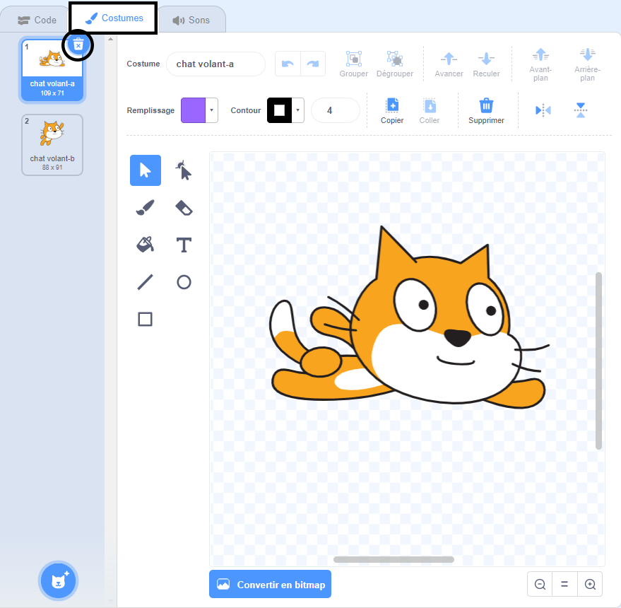
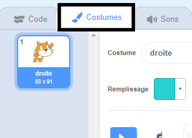
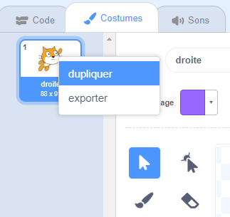
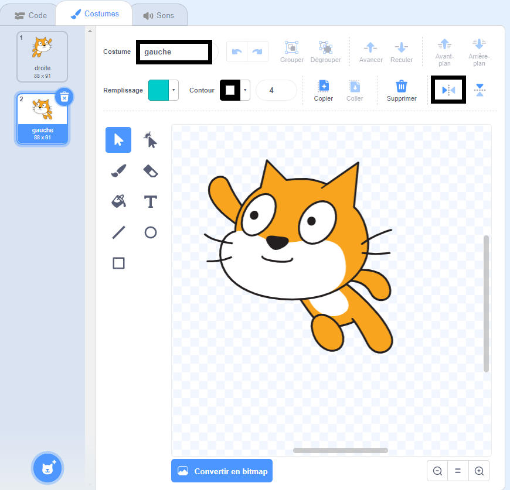

## Changement de costume

Hmm, cela aurait l'air mieux si le sprite de chat changeait de direction quand il tourne à gauche.

--- task ---

Clique sur «Costumes» et supprime le costume «chat volant-a».



--- /task ---

--- task ---

Renomme le costume restant, de «chat volant-b» en «droite».



--- /task ---

--- task ---

Fais un clic droit sur le costume et choisis dupliquer pour créer une copie.



--- /task ---

--- task ---

Clique sur «Retourner horizontalement» pour inverser la copie, puis nomme-la «gauche».

Tes costumes devraient ressembler à ceci:



--- /task ---

--- task ---

Clique sur «Code» pour retourner à ton code et ajoute des blocs pour changer le costume lorsque la direction est changée.


```blocks3
when [left arrow v] key pressed
+switch costume to (gauche v)
turn ccw (15) degrees

when [right arrow v] key pressed
+switch costume to (droite v)
turn cw (15) degrees
```

--- /task ---

--- task ---

Teste ton code en nageant sur la scène en utilisant les touches fléchées.


--- /task ---
