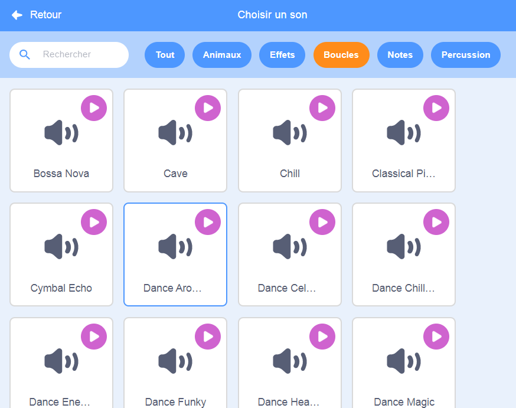

## Musique !

Une chorégraphie de natation synchronisée a besoin de musique. (Mais, si tu ne peux pas jouer de son, tu peux sauter cette étape.)

--- task ---

Choisis un son dans la catégorie `Boucles` et ajoute-le à ton sprite.

[[[generic-scratch3-sound-from-library]]]



--- /task ---

--- task ---

Maintenant, reviens à « Code » et ajoute les blocs pour jouer ta musique :


```blocks3
when green flag clicked
forever
play sound (dance around v) until done
end
```

Mettre le `jouer le son`{:class="block3sound"} dans une boucle `répéter indéfiniment`{:class="block3control"} signifie que la musique se répétera.

--- /task ---

--- task ---

Teste ton projet.

Tu peux cliquer sur le bouton d'arrêt rouge pour arrêter la lecture de la musique !

--- /task ---

