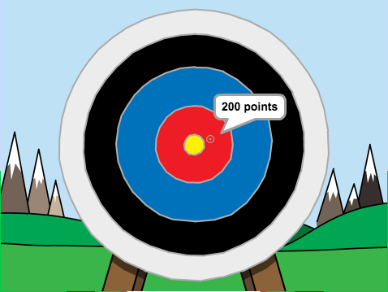

## Et ensuite?

Jette un œil au projet Scratch [Tir à l'arc](https://projects.raspberrypi.org/fr-FR/projects/archery).

--- no-print ---

Clique sur le drapeau vert pour démarrer. Utilise la barre d'espace pour tirer une flèche

  <iframe allowtransparency="true" width="485" height="402" src="https://scratch.mit.edu/projects/embed/382064493/?autostart=false" frameborder="0" scrolling="no"></iframe>
  

--- /no-print ---

--- print-only ---

--- /print-only ---

***
Ce projet a été traduit par des bénévoles:

Jonathan Vannieuwkerke

Michel Arnols

Grâce aux bénévoles, nous pouvons donner aux gens du monde entier la chance d'apprendre dans leur propre langue. Vous pouvez nous aider à atteindre plus de personnes en vous portant volontaire pour la traduction - plus d'informations sur [rpf.io/translate](https://rpf.io/translate).
