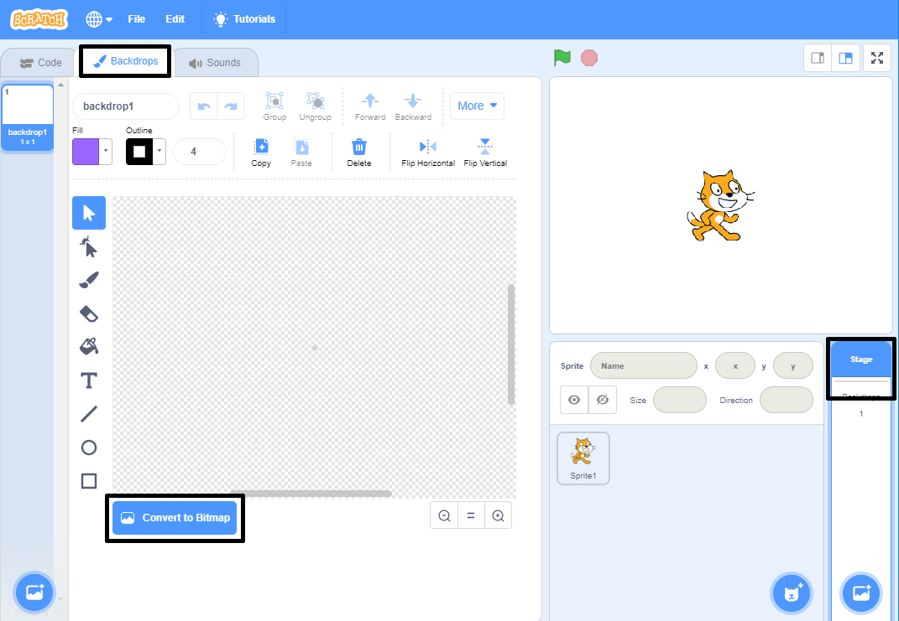
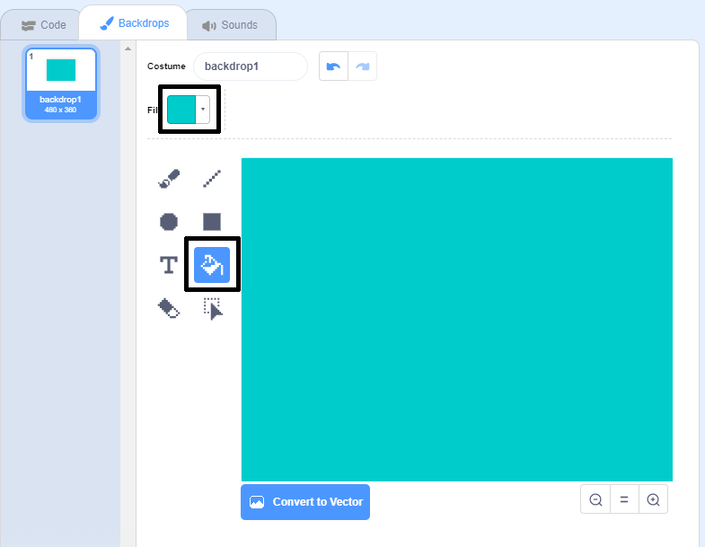

## बाएं और दाएं तैरना

सिंक्रनाइज़ तैराकी में  तैराकों की एक टीम संगीत पर एक डांस रूटीन करती है।

चलो एक बिल्ली को तैराने से शुरू करें।

--- task ---

एक नया Scratch प्रोजेक्ट खोलिये।

**Online**: open a [new online Scratch project](https://rpf.io/scratchnew){:target="_blank"}.

**ऑफ़लाइन**: ऑफलाइन एडिटर (offline editor) में एक नया प्रोजेक्ट खोलें |

If you need to download and install the Scratch offline editor, you can find it at [rpf.io/scratchoff](https://rpf.io/scratchoff){:target="_blank"}.

--- /task ---

पहले मंच को नीला करते हैं, ताकि यह एक स्विमिंग पूल जैसा लगे ।

--- task ---

पहले 'Stage' पर क्लिक करें, फिर ' बैकड्रॉप्स टैब ' (Backdrops tab) पर क्लिक करके 'कन्वर्ट टू बिटमैप' (Convert to Bitmap) पर क्लिक करें I



--- /task ---

--- task ---

एक नीले रंग और 'Fill with color' टूल का चयन करें और फिर बैकड्रॉप पर क्लिक करें।



--- /task ---

--- task ---

आप एक अलग बिल्ली स्प्राइट का उपयोग करने जा रहे हैं इसलिए इसे मिटाने के लिए चलने वाली बिल्ली पर क्रॉस पर क्लिक करें।


--- /task ---

--- task ---

लाइब्रेरी से cat flying sprite चुनें और इसे अपने प्रोजेक्ट में जोड़ें ।

[[[generic-scratch3-sprite-from-library]]]


उड़ने वाली बिल्ली को ऐसा लगता है कि वह तैर सकती है।

--- /task ---

--- task ---

अब चलो बिल्ली को तैराते हैं।

'cat flying' स्प्राइट का चयन करें, 'Code' पर क्लिक करें और जब आप बाएं और दाएं तीर बटन दबाते हैं तो बिल्ली को बाएं और दाएं घूमने के लिए कोड जोड़ें।


```blocks3
when [left arrow v] key pressed
turn ccw (15) degrees

when [right arrow v] key pressed
turn cw (15) degrees
```

--- /task ---

--- task ---

कीबोर्ड पर बाएं और दाएं तीर कुंजी दबाकर अपने कोड का परीक्षण करें।


--- /task ---

--- task ---

और उसे आगे या पीछे हिलाने के लिए कोड जोड़े I


```blocks3
when [up arrow v] key pressed
move (10) steps

when [down arrow v] key pressed
move (-10) steps 
```

--- /task ---

--- task ---

तीर बटन का उपयोग करके मंच के चारों ओर तैरकर अपने कोड का परीक्षण करें।

--- /task ---
