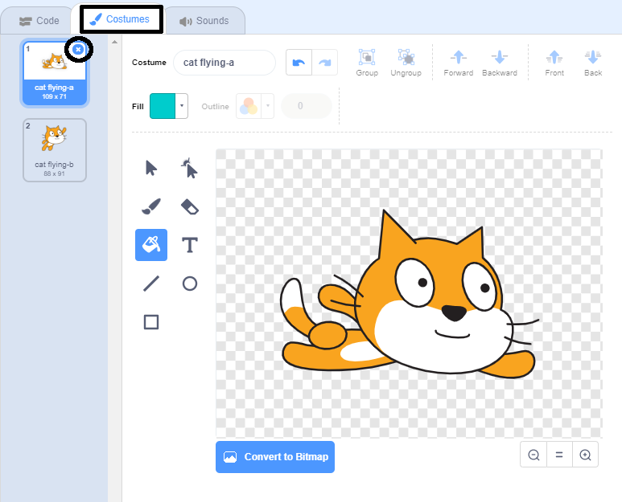

## वेशभूषा बदलना

हम्म, यह बेहतर होगा अगर बिल्ली बाईं ओर मुड़ने पर दिशा बदल दे।

--- task ---

'कॉस्ट्यूम' पर क्लिक करें और 'कैट फ़्लाइंग-ए' कॉस्ट्यूम को हटा दें।



--- /task ---

--- task ---

बचे हुए पोशाक का बदल कर  नाम 'cat flying-a' से 'right' बदल कर रखदें ।


--- /task ---

--- task ---

पोशाक पर राइट-क्लिक करें और कॉपी बनाने के लिए डुप्लिकेट चुनें।


--- /task ---

--- task ---

कॉपी को उलटने के लिए 'Flip Horizontal' पर क्लिक करें और फिर इसे 'left' नाम दें।

आपकी पोशाक इस तरह दिखनी चाहिए:


--- /task ---

--- task ---

अपने कोड पर लौटने के लिए 'Code' पर क्लिक करें और दिशा बदलने पर पोशाक को बदलने के लिए ब्लॉक जोड़ें।


```blocks3
when [left arrow v] key pressed
+switch costume to (left v)
turn ccw (15) degrees

when [right arrow v] key pressed
+switch costume to (right v)
turn cw (15) degrees
```

--- /task ---

--- task ---

तीर बटन का उपयोग करके मंच के चारों ओर तैरकर अपने कोड का परीक्षण (test) करें।


--- /task ---
