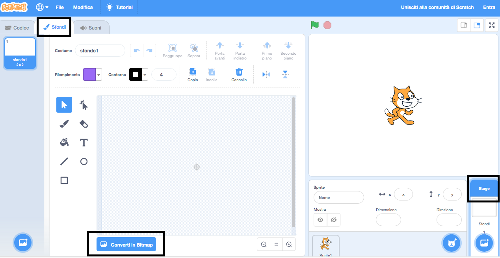
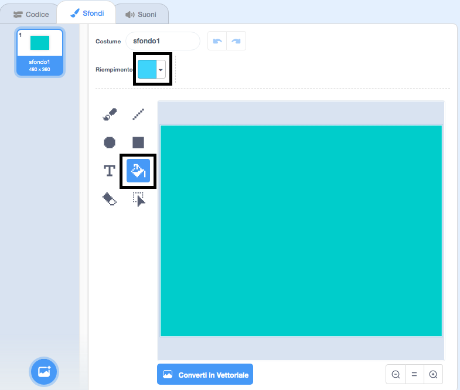
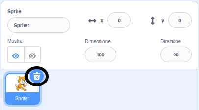

## Nuotare a sinistra e a destra

Nel nuoto sincronizzato una squadra di nuotatori esegue una routine coordinata di mosse seguendo la musica.

Cominciamo a fare nuotare un singolo gatto.

--- task ---

Inizia un nuovo progetto Scratch.

**Online**: open a [new online Scratch project](https://rpf.io/scratchnew){:target="_blank"}.

**Offline**: apri un nuovo progetto nell'editor offline.

If you need to download and install the Scratch offline editor, you can find it at [rpf.io/scratchoff](https://rpf.io/scratchoff){:target="_blank"}.

--- /task ---

Prima coloriamo lo Stage di blu in modo che sembri una piscina.

--- task ---

Clicca su 'Stage', poi sulla scheda 'Sfondi' e infine 'Converti in Bitmap'.



--- /task ---

--- task ---

Seleziona un colore blu e lo strumento "Riempimento con colore" e poi fai clic sullo sfondo.



--- /task ---

--- task ---

Utilizzerai uno sprite di gatto diverso, quindi fai clic sulla x per cancellare il gatto che cammina.



--- /task ---

--- task ---

Scegli lo sprite `Cat Flying` dalla libreria e aggiungilo al tuo progetto.

[[[generic-scratch3-sprite-from-library]]]


Il gatto volante sembra che stia nuotando.

--- /task ---

--- task ---

Adesso facciamo nuotare il gatto.

Seleziona lo sprite 'Cat flying', fai clic su "Codice" e aggiungi il codice per far ruotare il gatto a destra e sinistra quando premi i tasti freccia sinistra e destra.


```blocks3
when [left arrow v] key pressed
turn ccw (15) degrees

when [right arrow v] key pressed
turn cw (15) degrees
```

--- /task ---

--- task ---

Testa il tuo codice premendo i tasti freccia sinistra e destra sulla tastiera.


--- /task ---

--- task ---

E aggiungi il codice per il movimento avanti e indietro.


```blocks3
when [up arrow v] key pressed
move (10) steps

when [down arrow v] key pressed
move (-10) steps 
```

--- /task ---

--- task ---

Prova il tuo codice nuotando intorno al palcoscenico utilizzando i tasti freccia.

--- /task ---
