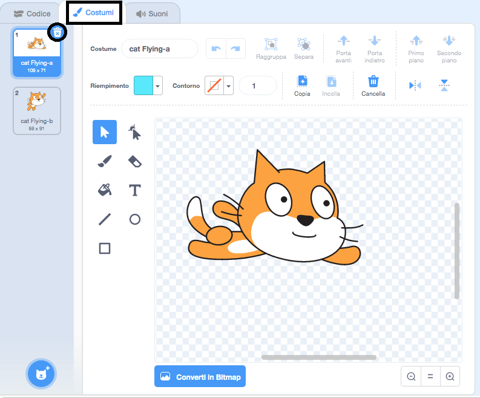
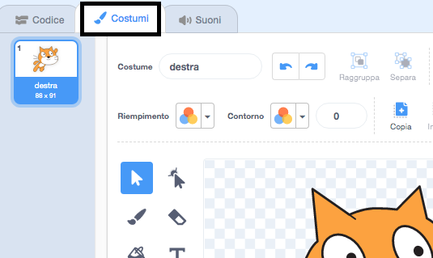
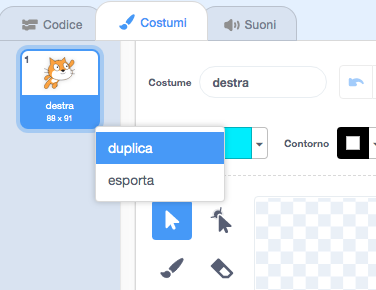
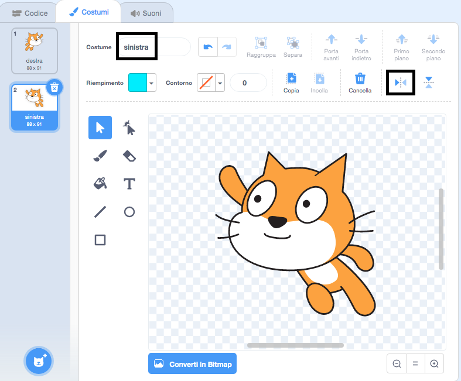

## Cambia costume

Hmm, sarebbe meglio se lo sprite del gatto cambiasse direzione quando gira a sinistra.

--- task ---

Fai clic su "Costumi" ed elimina il costume 'cat flying-a'.



--- /task ---

--- task ---

Rinomina il costume rimasto da 'cat flying-b' a 'destra'.



--- /task ---

--- task ---

Clicca col tasto destro del mouse sul costume e scegli Duplica per crearne una copia.



--- /task ---

--- task ---

Fai clic su 'Rifletti in Orizzontale' per invertire la copia e poi rinominala in 'sinistra'.

I tuoi costumi dovrebbero apparire così:



--- /task ---

--- task ---

Fai clic su 'Codice' per tornare al codice e aggiungere blocchi per cambiare il costume quando la direzione viene cambiata.


```blocks3
when [left arrow v] key pressed
+switch costume to (left v)
turn ccw (15) degrees

when [right arrow v] key pressed
+switch costume to (right v)
turn cw (15) degrees
```

--- /task ---

--- task ---

Prova il tuo codice nuotando intorno al palcoscenico utilizzando i tasti freccia.


--- /task ---
