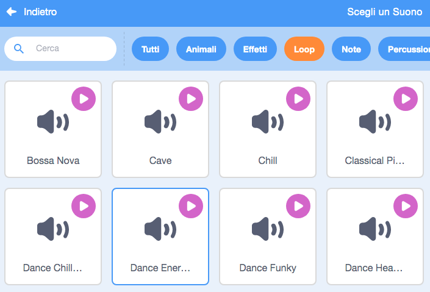

## Musica!

Una routine di nuoto sincronizzato ha bisogno di musica. (Se non riesci a riprodurre il suono, puoi saltare questo passaggio.)

--- task ---

Scegli un suono dalla categoria `cicli` e aggiungilo al tuo sprite.

[[[generic-scratch3-sound-from-library]]]



--- /task ---

--- task ---

Ora torna a 'Codice' e aggiungi i blocchi per riprodurre la tua musica:


```blocks3
when green flag clicked
forever
play sound (dance around v) until done
end
```

Mettere `riproduci suono`{:class="block3sound"} all'interno di un ciclo `per sempre`{:class="block3control"} significa che la musica continuerà a ripetersi.

--- /task ---

--- task ---

Prova il tuo progetto.

Puoi cliccare sul pulsante rosso di arresto per fermare la riproduzione musicale!

--- /task ---

