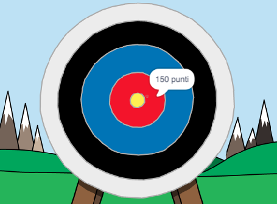

## E adesso?

Dai un'occhiata al progetto Scratch [Tiro con l'arco](https://projects.raspberrypi.org/en/projects/archery).

--- no-print ---

Clicca sulla bandierina verde per cominciare. Usa la barra spaziatrice per lanciare una freccia

  <iframe allowtransparency="true" width="485" height="402" src="https://scratch.mit.edu/projects/embed/114760038/?autostart=false" frameborder="0" scrolling="no"></iframe>
  

--- /no-print ---

--- print-only ---

--- /print-only ---
