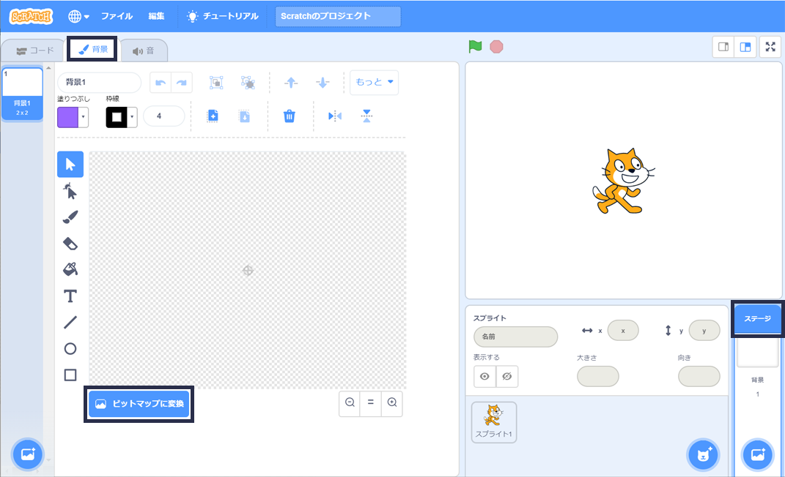
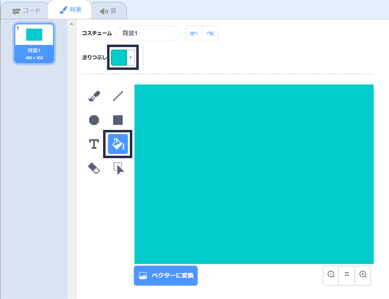

## 左右に泳ぐ

In synchronised swimming a team of swimmers perform a coordinated routine of moves to music.

まずは1ぴきのネコを泳がせることから始めましょう。

--- task ---

新しい Scratch プロジェクトを開きます。

**オンライン**: [新しいオンラインの Scratch プロジェクト](http://rpf.io/scratchnew){:target="_blank"}を開きます。

**オフライン**：オフラインエディターで新しいプロジェクトを開きます。

[rpf.io/scratchoff](http://rpf.io/scratchoff){:target="_blank"}から Scratch オフラインエディターをダウンロードしてインストールできます。

--- /task ---

まず、ステージを青色にかえて、水泳プールのようにしましょう。

--- task ---

「ステージ」から「背景 (はいけい) 」タブをクリックし、「ビットマップに変換 (へんかん)」をクリックします。



--- /task ---

--- task ---

青色をえらんで「塗り (ぬり) つぶし」ツールをクリックし、背景をクリックします。



--- /task ---

--- task ---

べつのネコのスプライトを使うので、右上にあるごみ箱のアイコンを押して (おして) 、歩いているネコのスプライトを削除 (さくじょ) します。


--- /task ---

--- task ---

Choose the `Cat Flying` sprite from the library and add it to your project.

[[[generic-scratch3-sprite-from-library]]]


The flying cat looks like it could be swimming.

--- /task ---

--- task ---

Now let's get the cat swimming.

Select the 'Cat flying' sprite, click 'Code' and add the code to make the cat rotate left and right when you press the left and right arrow keys.


```blocks3
when [left arrow v] key pressed
turn ccw (15) degrees

when [right arrow v] key pressed
turn cw (15) degrees
```

--- /task ---

--- task ---

Test your code by pressing the left and right arrow keys on the keyboard.


--- /task ---

--- task ---

And add the code for the forward and backward movement.


```blocks3
when [up arrow v] key pressed
move (10) steps

when [down arrow v] key pressed
move (-10) steps 
```

--- /task ---

--- task ---

Test your code by swimming around the stage using the arrow keys.

--- /task ---
