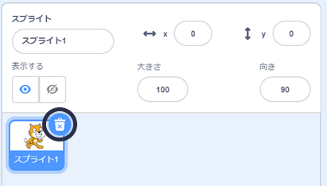

## 左右に泳ぐ

In synchronised swimming a team of swimmers perform a coordinated routine of moves to music.

まずは1ぴきのネコを泳がせることから始めましょう。

--- task ---

新しい Scratch プロジェクトを開きます。

**オンライン**: [新しいオンラインの Scratch プロジェクト](http://rpf.io/scratchnew){:target="_blank"}を開きます。

**オフライン**：オフラインエディターで新しいプロジェクトを開きます。

[rpf.io/scratchoff](http://rpf.io/scratchoff){:target="_blank"}から Scratch オフラインエディターをダウンロードしてインストールできます。

--- /task ---

まず、ステージを青色にかえて、水泳プールのようにしましょう。

--- task ---

「ステージ」から「背景 (はいけい) 」タブをクリックし、「ビットマップに変換 (へんかん)」をクリックします。


--- /task ---

--- task ---

青色をえらんで「塗り (ぬり) つぶし」ツールをクリックし、背景をクリックします。


--- /task ---

--- task ---

べつのネコのスプライトを使うので、右上にあるごみ箱のアイコンを押して (おして) 、歩いているネコのスプライトを削除 (さくじょ) します。



--- /task ---

--- task ---

ライブラリから`Cat Flying` (とんでいるネコ) スプライトをえらび、プロジェクトに追加 (ついか) します。

[[[generic-scratch3-sprite-from-library]]]


とんでいるネコは泳いでいるようにも見えます。

--- /task ---

--- task ---

さあ、ネコを泳がせましょう。

「Cat Flying」スプライトを選択 (せんたく) して「コード」をクリックし、左右の矢印キーを押したときにネコを左右に回転させるコードを追加します。


```blocks3
when [left arrow v] key pressed
turn ccw (15) degrees

when [right arrow v] key pressed
turn cw (15) degrees
```

--- /task ---

--- task ---

キーボードで左右の矢印キーを押して、コードをテストしてみましょう。


--- /task ---

--- task ---

そして、前後に動くコードを追加します。


```blocks3
when [up arrow v] key pressed
move (10) steps

when [down arrow v] key pressed
move (-10) steps 
```

--- /task ---

--- task ---

Test your code by swimming around the stage using the arrow keys.

--- /task ---
