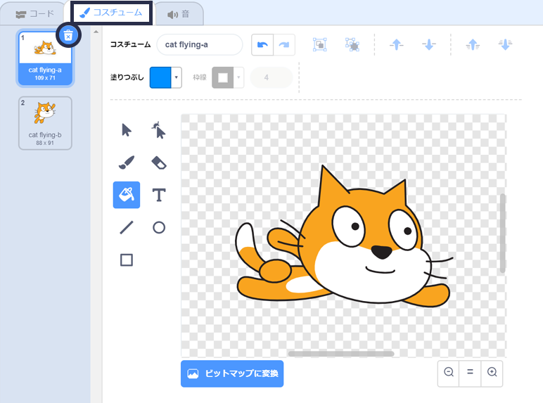
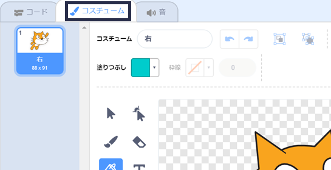
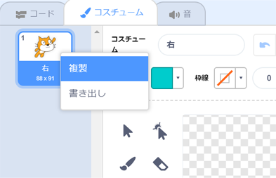
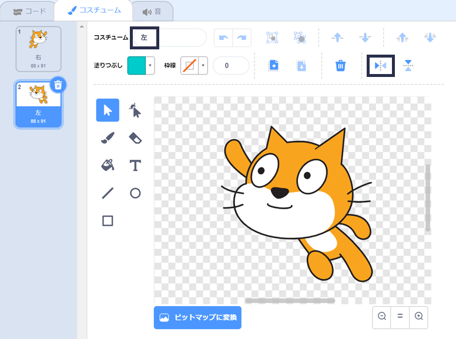

## コスチュームをかえる

うーん、ネコのスプライトが左に向いたときには、向きをかえた方が見た目が良いですね。

--- task ---

「コスチューム」をクリックして「cat flying-a」コスチュームを削除します。



--- /task ---

--- task ---

のこったコスチュームの名前を「cat flying-b」から「右」にかえます。



--- /task ---

--- task ---

コスチュームを右クリックし、「複製」（ふくせい）をえらんでコピーを作ります。



--- /task ---

--- task ---

「左右反転」のアイコンをクリックし、コピーしたものを反転して、名前を「左」にします。

コスチュームは次のようになります。



--- /task ---

--- task ---

「コード」をクリックしてコードにもどり、ブロックを追加して向きがかわったらコスチュームもかわるようにします。


```blocks3
when [left arrow v] key pressed
+switch costume to (左 v)
turn ccw (15) degrees

when [right arrow v] key pressed
+switch costume to (右 v)
turn cw (15) degrees
```

--- /task ---

--- task ---

矢印キーを使い、ステージ中を泳いでコードをテストしましょう。


--- /task ---
