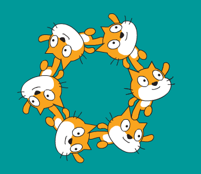

## チームを作る

アーティスティック・スイミングにはもっとたくさんのネコが必要です！ `クローンを作る`{:class="block3control"}を使って、同じ動作をするコピーを作ることができます。

--- task ---

まず、緑の旗 (はた) を押したときにいつも同じ位置 (いち) から開始するようにコードを追加しましょう。


```blocks3
when green flag clicked
go to x: (0) y: (0)
point in direction (90 v)
```

--- /task ---

--- task ---

矢印キーを何回か押してから、緑の旗をクリックしてみて、はじめの位置にもどるかテストしましょう。

--- /task ---

--- task ---

これで`繰り返す`{:class="block3control"} (くりかえす) ループを使って、6ぴきのネコのクローン（コピー）を作ることができます。


```blocks3
when green flag clicked
go to x: (0) y: (0)
point in direction (90 v)
+repeat (6)
create clone of (myself v)
end
```

ループは同じことを何回もするのに使います。

--- /task ---

--- task ---

ネコがすべて同じ位置になるのはいやですよね・・・。

それぞれのクローンをつくる前に、60度回転するコードを追加します。


```blocks3
when green flag clicked
go to x: (0) y: (0)
point in direction (90 v)
repeat (6)
+turn cw (60) degrees
create clone of (myself v)
end
```

--- /task ---

--- task ---

 矢印キーを使ってコードをテストしましょう。 You should be able to create some amazing synchronised swimming patterns!



--- /task ---
