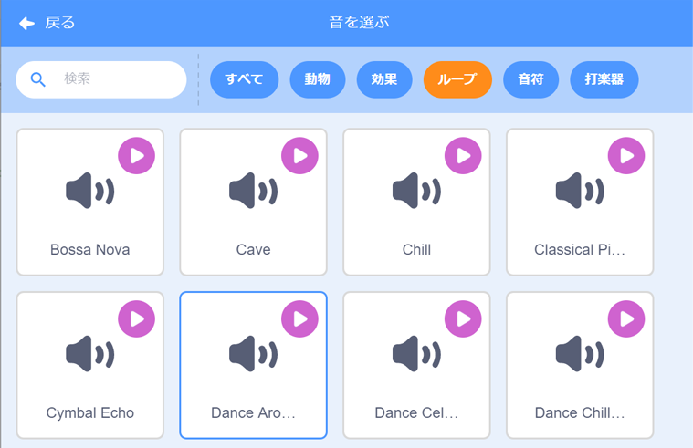

## 音楽！

アーティスティック・スイミングには音楽が必要です。 （ただし、音楽を再生できない場合はこの手順 (てじゅん) をとばすことができます。）

--- task ---

`ループ`カテゴリから音楽をえらび、スプライトに追加します。

[[[generic-scratch3-sound-from-library]]]



--- /task ---

--- task ---

ここで「コード」にもどって、音楽を再生するブロックを追加します。


```blocks3
when green flag clicked
forever
play sound (dance around v) until done
end
```

`音を鳴らす`{:class="block3sound"}を`ずっと`{:class="block3control"}ループの中に入れると、音楽が繰り返し再生されます。

--- /task ---

--- task ---

プロジェクトをテストしましょう。

赤色の「止める」ボタンをクリックすると、音楽の再生を止めることができます。

--- /task ---

