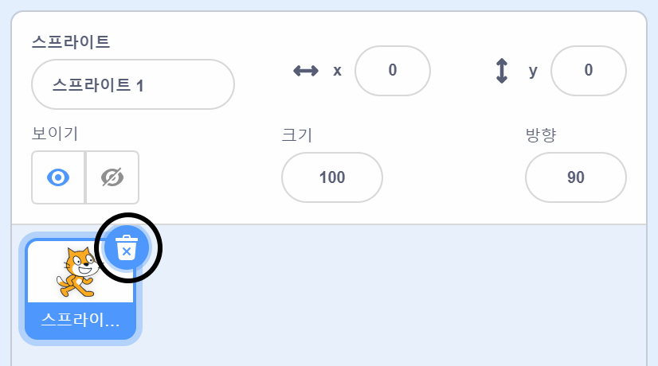

## 좌우로 수영하기

리듬 수영을 하는 고양이들은 음악의 박자에 맞춰 동작을 선보일 것입니다.

고양이 한 마리가 수영하게 해봅시다.

--- task ---

새 스크래치 프로젝트를 엽니다.

**온라인**: [새로 만들기](https://rpf.io/scratchnew){:target="_blank"}를 클릭합니다.

**오프라인**: 오프라인 편집기에서 새 프로젝트를 엽니다.

스크래치 오프라인 에디터를 다운로드 받아야 하는 경우, [rpf.io/scratchoff](https://rpf.io/scratchoff){:target="_blank"} 에서 다운로드 받을 수 있습니다.

--- /task ---

먼저 스테이지를 파란색으로 바꿔서 수영장처럼 보이도록 하겠습니다.

--- task ---

'무대'를 클릭 한 다음 '배경' 탭과 '비트맵으로 바꾸기'를 클릭하세요.


--- /task ---

--- task ---

파란색과 '채우기' 도구를 선택한 다음 배경을 클릭하세요.


--- /task ---

--- task ---

다른 고양이 스프라이트를 사용할 것이므로, 기본 고양이 스프라이트의 x 표시를 클릭하여 삭제하세요.



--- /task ---

--- task ---

라이브러리에서 `Cat Flying` 스프라이트를 골라 프로젝트에 추가하세요.

[[[generic-scratch3-sprite-from-library]]]


생각하기에 따라 날아다니는 고양이가 수영하는 것처럼 보일 수도 있겠죠?

--- /task ---

--- task ---

이제 고양이가 수영하도록 해봅시다.

'Cat flying' 스프라이트를 선택하고 '코드'를 클릭한 다음 왼쪽 및 오른쪽 화살표 키를 누를 때 고양이가 왼쪽과 오른쪽으로 회전하도록 코드를 추가하세요.


```blocks3
when [left arrow v] key pressed
turn ccw (15) degrees

when [right arrow v] key pressed
turn cw (15) degrees
```

--- /task ---

--- task ---

키보드에서 왼쪽 및 오른쪽 화살표 키를 눌러 코드를 테스트하세요.


--- /task ---

--- task ---

전진 및 후진을 위한 코드를 추가하세요.


```blocks3
when [up arrow v] key pressed
move (10) steps

when [down arrow v] key pressed
move (-10) steps 
```

--- /task ---

--- task ---

화살표 키를 사용하여 무대 주위에서 수영하면서 코드를 테스트하세요.

--- /task ---
