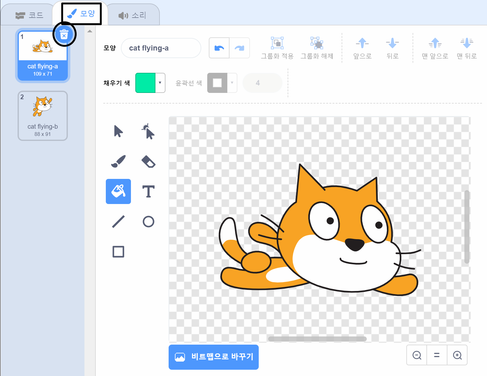
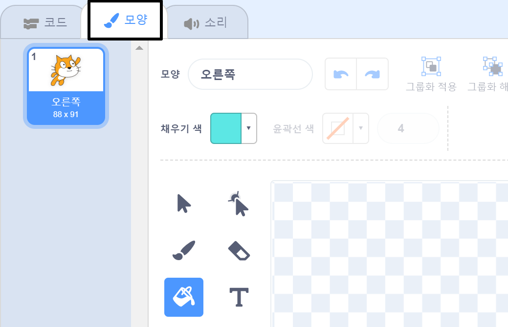
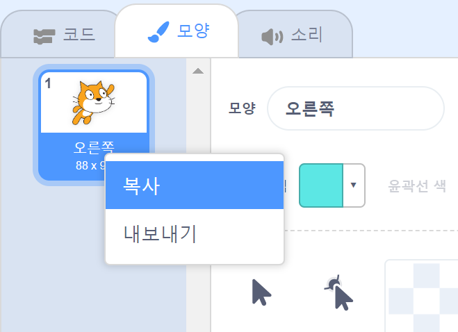
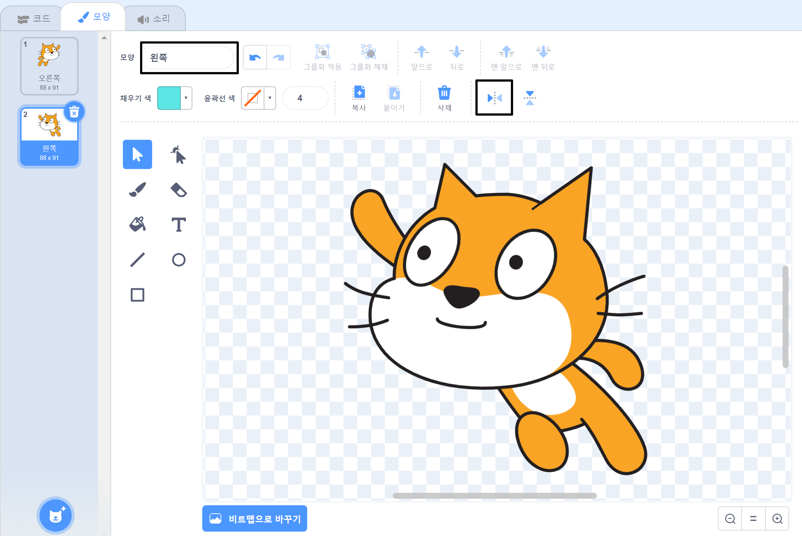

## 모양 바꾸기

흠, 고양이 스프라이트가 왼쪽으로 돌 때 방향이 바뀌면 더 좋을 것 같네요.

--- task ---

'모양'를 클릭하고 'cat flying-a' 모양을 삭제해주세요.



--- /task ---

--- task ---

남은 의상의 이름을 'cat flying-b'에서 '오른쪽'으로 바꿉니다.



--- /task ---

--- task ---

마우스 오른쪽 버튼으로 모양을 클릭하고 복사를 클릭하여 모양의 사본을 만듭니다.



--- /task ---

--- task ---

'좌우 뒤집기'를 클릭하여 사본을 뒤집은 다음 이름을 '왼쪽'으로 지정하세요.

모양들은 다음과 같을 것입니다:



--- /task ---

--- task ---

'코드'를 클릭하여 코드로 돌아가고 방향이 변경되면 의상을 변경하는 블록을 추가하세요.


```blocks3
when [left arrow v] key pressed
+switch costume to (left v)
turn ccw (15) degrees

when [right arrow v] key pressed
+switch costume to (right v)
turn cw (15) degrees
```

--- /task ---

--- task ---

화살표 키를 사용하여 무대 주위에서 수영하면서 코드를 테스트하세요.


--- /task ---
