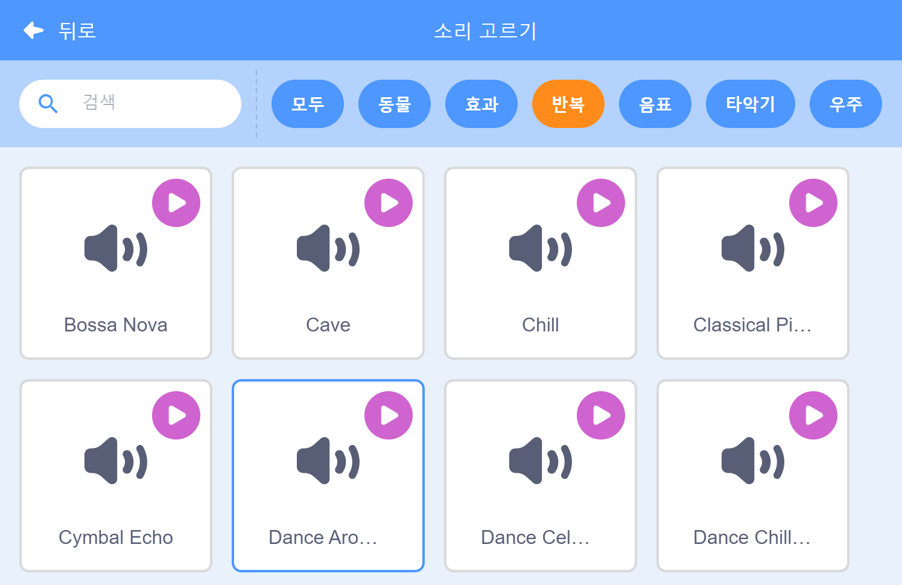

## 뮤직!

리듬 수영에는 음악이 필요합니다. (그러나 소리를 재생할 수 없다면 이 단계를 건너 뛸 수 있습니다.)

--- task ---

`반복` 카테고리에서 원하는 소리를 고르고 스프라이트에 추가하세요.

[[[generic-scratch3-sound-from-library]]]



--- /task ---

--- task ---

이제 '코드'로 돌아가서 음악을 재생할 블록을 추가하세요.


```blocks3
when green flag clicked
forever
play sound (dance around v) until done
end
```

`재생하기`{:class="block3sound"} 블록을 `무한 반복하기`{:class="block3control"} 블록 안에 넣으면 음악이 계속 반복될 것입니다.

--- /task ---

--- task ---

프로젝트를 테스트하세요.

팁: 빨간색 중지 버튼을 클릭하면 음악 재생이 중지됩니다!

--- /task ---

