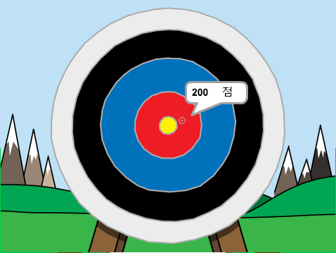

## 더 나아가기

[활 쏘기](https://projects.raspberrypi.org/en/projects/archery) 스크래치 프로젝트를 살펴봅시다.

--- no-print ---

시작하려면 녹색 깃발을 클릭하세요. 스페이스 바를 눌러 화살을 쏠 수 있습니다.

  <iframe allowtransparency="true" width="485" height="402" src="https://scratch.mit.edu/projects/embed/114760038/?autostart=false" frameborder="0" scrolling="no"></iframe>
  

--- /no-print ---

--- print-only ---

--- /print-only ---
