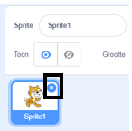

## Links en rechts zwemmen

In synchroonzwemmen voert een team zwemmers een gecoördineerde routine van bewegingen op muziek uit.

Laten we beginnen met één kat aan het zwemmen te krijgen.

--- task ---

Open een nieuw Scratch project.

**Online**: open een [nieuw online Scratch-project](http://rpf.io/scratchnew){:target="_blank"}.

**Offline:** open een nieuw project in de offline editor.

Als je de Scratch offline editor wilt downloaden en installeren dan kan je die vinden op [rpf.io/scratchoff](http://rpf.io/scratchoff){:target="_blank"}.

--- /task ---

Laten we eerst het speelveld blauw maken, zodat het eruit ziet als een zwembad.

--- task ---

Klik op 'Speelveld' en vervolgens op het tabblad 'Achtergronden' en 'Zet om naar bitmap'.


--- /task ---

--- task ---

Selecteer een blauwe kleur en het gereedschap 'Vulling' en klik vervolgens op de achtergrond.


--- /task ---

--- task ---

Je gaat een andere kattensprite gebruiken, dus klik op het kruis op de lopende kat om deze te verwijderen.



--- /task ---

--- task ---

Kies de `Cat Flying` sprite uit de bibliotheek en voeg deze toe aan je project.

[[[generic-scratch3-sprite-from-library]]]


De vliegende kat lijkt te kunnen zwemmen.

--- /task ---

--- task ---

Laten we de kat nu laten zwemmen.

Selecteer de 'Cat flying' sprite, klik op 'Code' en voeg de code toe om de kat naar links en rechts te laten draaien wanneer je op de pijltjestoetsen links en rechts drukt.


```blocks3
wanneer [pijltje links v] is ingedrukt
draai (15) graden naar links

wanneer [pijltje rechts v] is ingedrukt
draai (15) graden naar rechts
```

--- /task ---

--- task ---

Test je code door op de pijltoetsen links en rechts op het toetsenbord te drukken.


--- /task ---

--- task ---

En voeg de code toe voor de voorwaartse en achterwaartse beweging.


```blocks3
wanneer [pijltje omhoog v] is ingedrukt
neem (10) stappen

wanneer [pijltje omlaag v] is ingedrukt
neem (-10) stappen 
```

--- /task ---

--- task ---

Test je code door met de pijltjestoetsen in het speelveld te zwemmen.

--- /task ---
