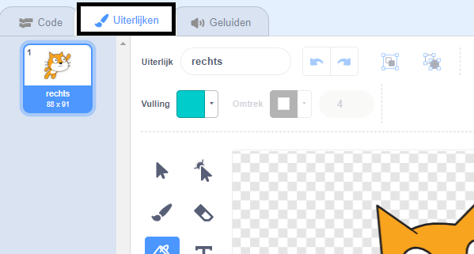
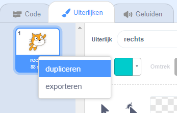
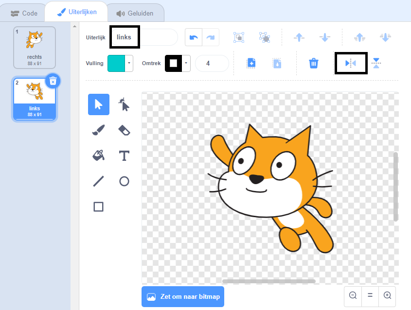

## Van uiterlijk veranderen

Hmm, dit zou er beter uitzien als de kat sprite van richting zou veranderen als hij naar links draait.

--- task ---

Klik op 'Uiterlijken' en verwijder het 'cat flying-a' uiterlijk.


--- /task ---

--- task ---

Wijzig de naam van het overgebleven uiterlijk van 'cat flying-b' naar 'rechts'.



--- /task ---

--- task ---

Klik met de rechtermuisknop op het uiterlijk en kies dupliceren om een kopie te maken.



--- /task ---

--- task ---

Klik op 'Horizontaal spiegelen' om de kopie om te keren en noem deze vervolgens 'links'.

Je uiterlijken moeten er zo uitzien:



--- /task ---

--- task ---

Klik op 'Code' om terug te keren naar je code en blokken toe te voegen om het uiterlijk te laten veranderen wanneer de richting wordt gewijzigd.


```blocks3
wanneer [pijltje links v] is ingedrukt
+ verander uiterlijk naar (links v)
draai (15) graden naar links

wanneer [pijltje rechts v] is ingedrukt
+ verander uiterlijk naar (rechts v)
draai (15) graden naar rechts
```

--- /task ---

--- task ---

Test je code met de pijltjestoetsen en laat de kat in het speelveld rondzwemmen en van richting veranderen.


--- /task ---
