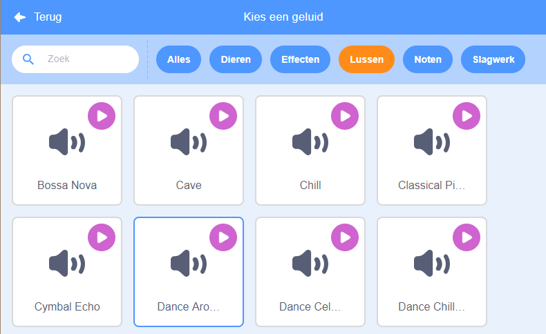
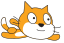

## Muziek!

Een gesynchroniseerde zwemroutine heeft muziek nodig. (Maar als je geen geluid kunt afspelen, kun je deze stap overslaan.)

--- task ---

Kies een geluid uit de categorie `Geluiden` en voeg het toe aan je sprite.

[[[generic-scratch3-sound-from-library]]]



--- /task ---

--- task ---

Ga nu terug naar 'Code' en voeg de blokken toe om je muziek af te spelen:



```blocks3
when green flag clicked
herhaal
start geluid (dance around v) en wacht
einde
```

Door het `geluid`{:class="block3sound"} in een lus `herhaal`{:class="block3control"} te plaatsen, blijft de muziek zich herhalen.

--- /task ---

--- task ---

Test je project.

Je kunt op de rode stopknop klikken om het afspelen van de muziek te stoppen!

--- /task ---

