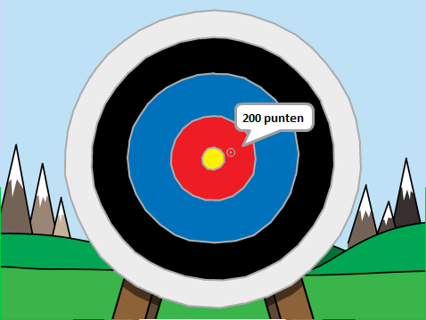

## Wat kun je verder nog doen?

Bekijk het [Boogschieten](https://projects.raspberrypi.org/nl-NL/projects/archery) Scratch-project.

--- no-print ---

Klik op de groene vlag om te starten. Gebruik de spatiebalk om een pijl te schieten

  <iframe allowtransparency="true" width="485" height="402" src="https://scratch.mit.edu/projects/embed/382068478/?autostart=false" frameborder="0" scrolling="no"></iframe>
  

--- /no-print ---

--- print-only ---

--- /print-only ---

***
Dit project werd vertaald door vrijwilligers:

Sanneke van der Meer

Robert-Jan Kempenaar

Dankzij vrijwilligers kunnen we mensen over de hele wereld de kans geven om in hun eigen taal te leren. Jij kunt ons helpen meer mensen te bereiken door vrijwillig te starten met vertalen - meer informatie op [rpf.io/translate](https://rpf.io/translate).
