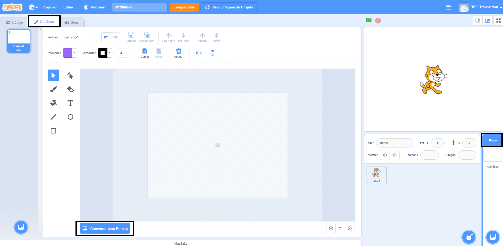
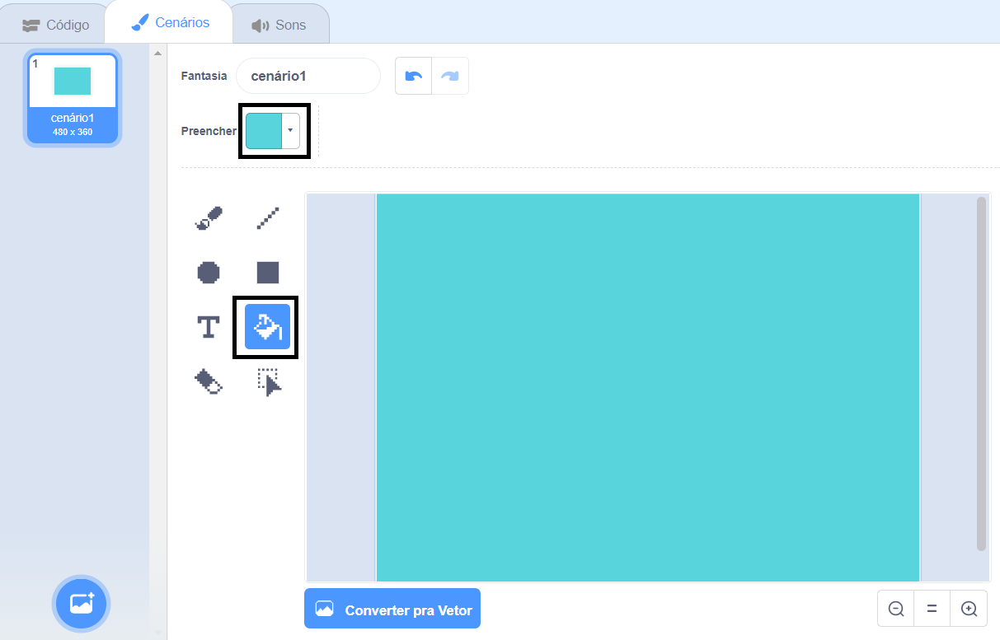
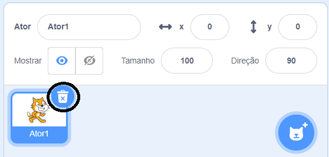

## Nadando à esquerda e à direita

Na natação sincronizada, uma equipe de nadadores realiza uma sequência coordenada de movimentos para a música.

Vamos começar fazendo um gato nadar.

--- task ---

Abra um projeto novo Scratch.

**Online**: abra um [novo projeto do Scratch online](http://rpf.io/scratchnew){:target="_blank"}.

**Offline**: abra um novo projeto no editor offline.

Se você precisar baixar e instalar o editor offline do Scratch, você pode encontrá-lo em [rpf.io/scratchoff](http://rpf.io/scratchoff){:target="_blank"}.

--- /task ---

Primeiro, vamos deixar o fundo azul para que pareça uma piscina.

--- task ---

Clique no 'Palco' e, em seguida, na guia 'Pano de Fundo' e em 'Converter para Bitmap'.



--- /task ---

--- task ---

Selecione uma cor azul e a ferramenta 'Preencher com cor' e clique no pano de fundo.



--- /task ---

--- task ---

Você usará um gato diferente, então clique na cruz do gato para excluí-lo.



--- /task ---

--- task ---

Escolha o `gato voando` na biblioteca e adicione-o ao seu projeto.

[[[generic-scratch3-sprite-from-library]]]


O gato voador parece que está nadando.

--- /task ---

--- task ---

Agora vamos fazer o gato nadar.

Selecione o "gato voando", clique em 'Code' e adicione o código para fazer o gato girar para a esquerda e direita, quando você pressionar as teclas de seta esquerda e direita.


```blocks3
when [left arrow v] key pressed
turn ccw (15) degrees

when [right arrow v] key pressed
turn cw (15) degrees
```

--- /task ---

--- task ---

Teste seu código pressionando as teclas de seta esquerda e direita do teclado.


--- /task ---

--- task ---

E adicione o código para o movimento para frente e para trás.


```blocks3
when [up arrow v] key pressed
move (10) steps

when [down arrow v] key pressed
move (-10) steps 
```

--- /task ---

--- task ---

Teste seu código nadando pelo palco usando as teclas de seta do teclado

--- /task ---
